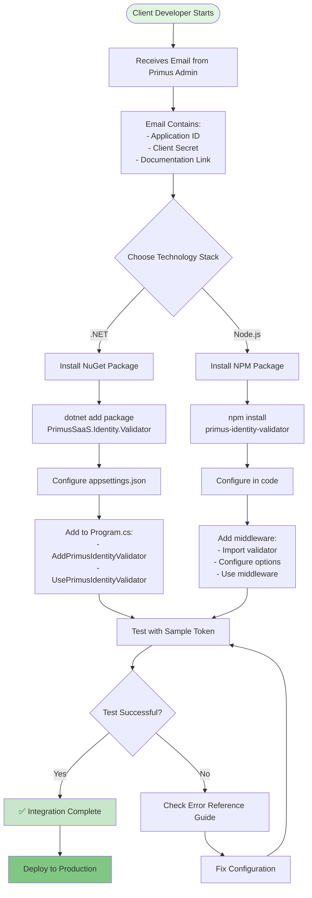
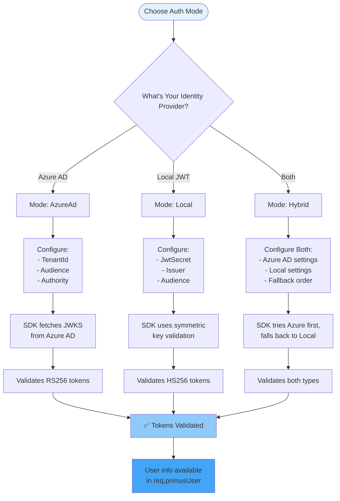
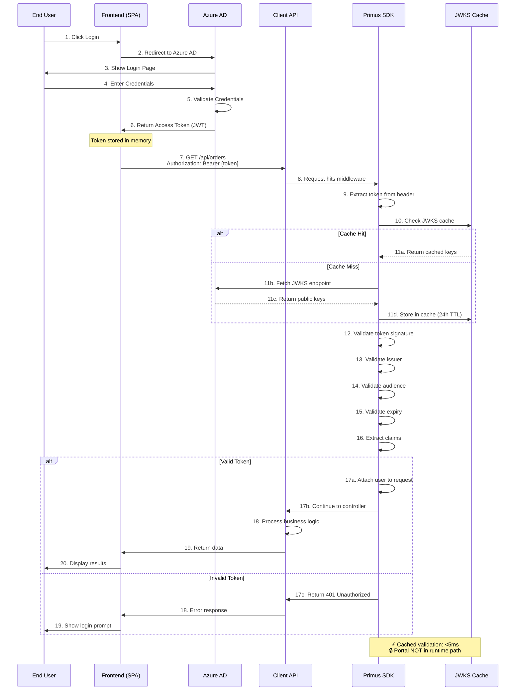
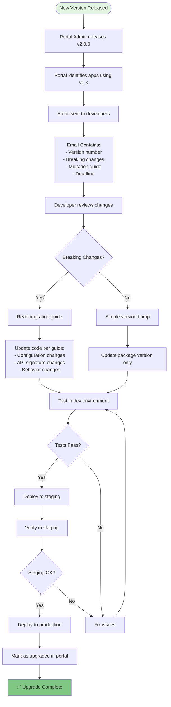
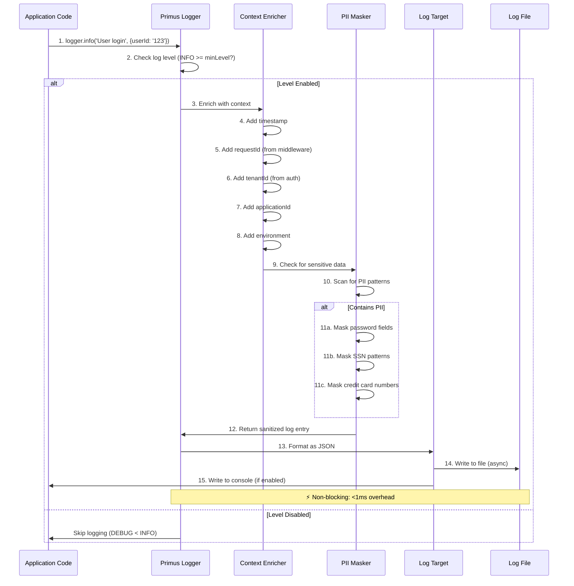
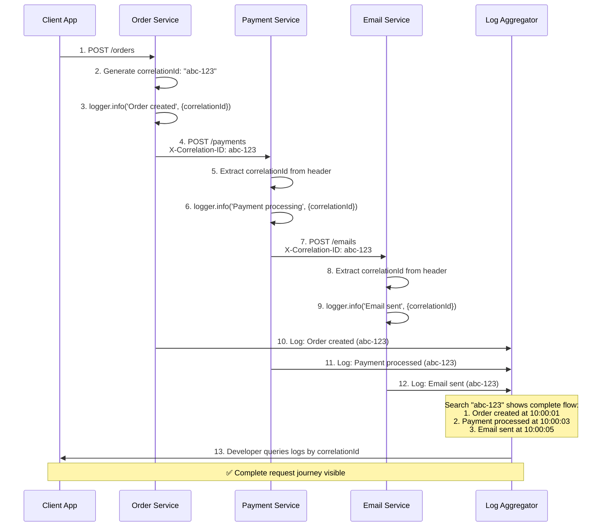
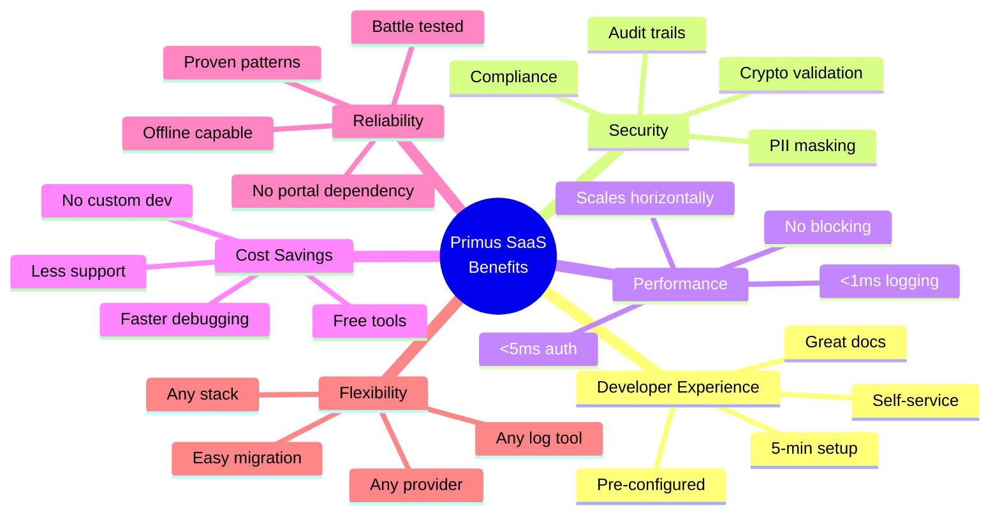
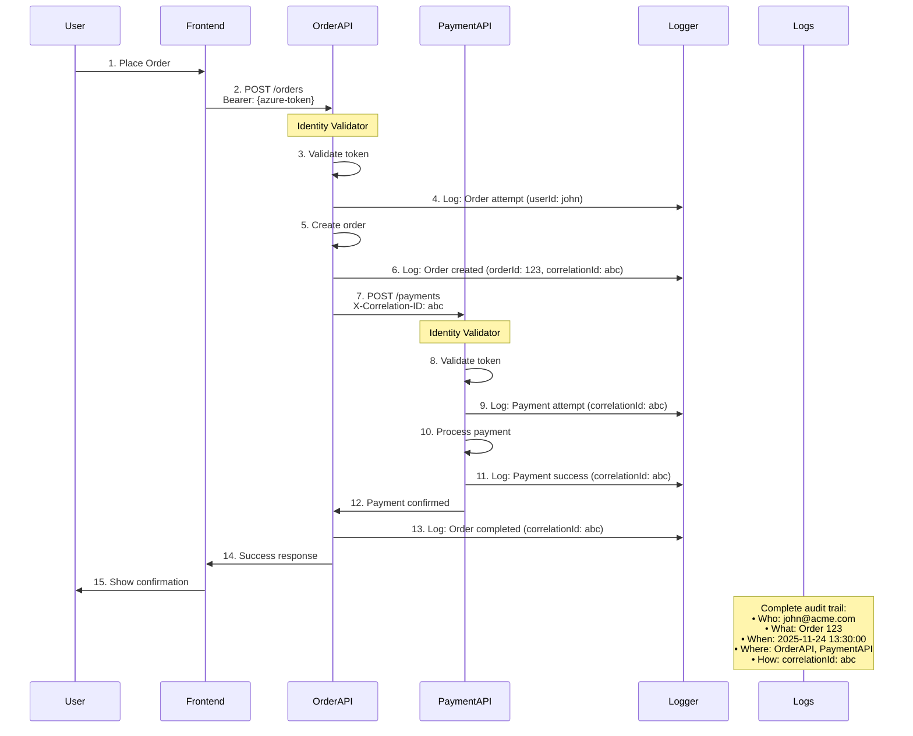

# 🔄 Primus SaaS - Client App Flow Diagrams

**Version**: 1.0  
**Date**: November 24, 2025  
**Purpose**: Step-by-step flow diagrams for each module integration from client perspective

---

## 📋 Table of Contents

1. [Module 1: Identity Validator - Complete Flow](#module-1-identity-validator)
2. [Module 2: Logging - Complete Flow](#module-2-logging)
3. [Cross-Module Integration Flow](#cross-module-integration)
4. [Benefits Summary](#benefits-summary)

---

## Module 1: Identity Validator - Complete Flow

### 1.1 Initial Setup Flow



**Benefits at Each Step:**
- **Email Receipt**: Zero manual configuration lookup - everything provided upfront
- **Package Install**: Single command - no complex dependencies
- **Configuration**: Pre-filled values from portal - copy-paste ready
- **Testing**: Immediate feedback - know if it works before deployment
- **Error Handling**: Guided troubleshooting - faster resolution

---

### 1.2 Authentication Mode Selection Flow



**Benefits:**
- **Flexibility**: Support any identity provider without code changes
- **Migration Path**: Hybrid mode enables gradual migration from Local to Azure AD
- **Zero Vendor Lock-in**: Switch providers by changing configuration only
- **Multi-tenant Ready**: Different tenants can use different providers

---

### 1.3 Runtime Request Flow (Azure AD Mode)



**Benefits:**
- **Performance**: JWKS caching means <5ms validation after first request
- **Offline Capable**: No dependency on Primus Portal at runtime
- **Scalability**: Stateless validation - scales horizontally
- **Security**: Cryptographic validation - no database lookups
- **Reliability**: Works even if portal is down

---

### 1.4 Error Handling Flow

```mermaid
flowchart TD
    Start([Token Validation Fails]) --> A{What's the Error?}
    
    A -->|Invalid Signature| B1[Error: INVALID_SIGNATURE]
    A -->|Token Expired| B2[Error: TOKEN_EXPIRED]
    A -->|Wrong Audience| B3[Error: INVALID_AUDIENCE]
    A -->|Wrong Issuer| B4[Error: INVALID_ISSUER]
    A -->|Malformed Token| B5[Error: MALFORMED_TOKEN]
    
    B1 --> C1[Check:<br/>- JWKS endpoint accessible?<br/>- Token from correct tenant?<br/>- Clock skew issues?]
    B2 --> C2[Check:<br/>- Token not expired?<br/>- System time correct?<br/>- Refresh token flow working?]
    B3 --> C3[Check:<br/>- Audience matches config?<br/>- Azure AD app ID correct?<br/>- Case sensitivity?]
    B4 --> C4[Check:<br/>- Tenant ID correct?<br/>- Authority URL correct?<br/>- Multi-tenant config?]
    B5 --> C5[Check:<br/>- Token format (3 parts)?<br/>- Base64 encoding valid?<br/>- Special characters?]
    
    C1 --> D[Consult ERROR_REFERENCE.md]
    C2 --> D
    C3 --> D
    C4 --> D
    C5 --> D
    
    D --> E[Apply Fix from Guide]
    E --> F{Fixed?}
    F -->|Yes| G[✅ Validation Succeeds]
    F -->|No| H[Contact Support with:<br/>- Error code<br/>- Token header<br/>- Configuration]
    
    H --> I[Support provides solution]
    I --> E
    
    style Start fill:#ffebee
    style G fill:#c8e6c9
    style H fill:#fff9c4
```

**Benefits:**
- **Self-Service**: Comprehensive error guides reduce support tickets
- **Fast Resolution**: Common errors documented with solutions
- **Learning**: Developers understand authentication better
- **Debugging**: Clear error codes make troubleshooting systematic

---

### 1.5 Upgrade Flow (Version Update)



**Benefits:**
- **Proactive Notification**: Know about updates before they're critical
- **Guided Migration**: Step-by-step instructions reduce errors
- **Version Tracking**: Portal knows what version each app uses
- **Rollback Plan**: Clear documentation enables safe rollbacks
- **Minimal Downtime**: Test in lower environments first

---

## Module 2: Logging - Complete Flow

### 2.1 Initial Setup Flow

```mermaid
flowchart TD
    Start([Developer Wants Logging]) --> A[Check portal for Logging module]
    
    A --> B[Admin assigns Logging module]
    B --> C[Email with integration docs]
    
    C --> D{Choose Stack}
    D -->|.NET| E1[Install NuGet:<br/>PrimusSaaS.Logging]
    D -->|Node.js| E2[Install NPM:<br/>@primus-saas/logging]
    
    E1 --> F1[Configure in appsettings.json:<br/>- ApplicationId<br/>- Environment<br/>- MinLevel<br/>- Targets]
    E2 --> F2[Configure in code:<br/>- ApplicationId<br/>- Environment<br/>- MinLevel<br/>- Targets]
    
    F1 --> G1[Initialize logger:<br/>services.AddPrimusLogging()]
    F2 --> G2[Initialize logger:<br/>createLogger(config)]
    
    G1 --> H[Replace existing logging calls]
    G2 --> H
    
    H --> I[logger.info('message', context)]
    I --> J[Logs written to configured targets]
    
    J --> K{Verify logs}
    K -->|Console| L1[See structured JSON in console]
    K -->|File| L2[See logs in file]
    K -->|Both| L3[See in both locations]
    
    L1 --> M[✅ Logging Active]
    L2 --> M
    L3 --> M
    
    style Start fill:#fff3e0
    style M fill:#ffb74d
```

**Benefits:**
- **Quick Setup**: 5 minutes from install to first log
- **No Infrastructure**: No need to set up log servers initially
- **Structured Output**: JSON format works with any log aggregator
- **Flexible Targets**: Console for dev, files for production

---

### 2.2 Runtime Logging Flow



**Benefits:**
- **Auto-Enrichment**: Context added automatically - no manual tracking
- **Security**: PII masked by default - compliance ready
- **Performance**: Async writes - no blocking
- **Correlation**: RequestId links all logs from same request
- **Multi-tenant Safe**: TenantId ensures log isolation

---

### 2.3 Integration with Identity Validator

```mermaid
flowchart TD
    Start([Request Arrives]) --> A[Identity Validator Middleware]
    
    A --> B[Validate Token]
    B --> C{Valid?}
    
    C -->|Yes| D[Extract user info:<br/>- userId<br/>- tenantId<br/>- roles]
    C -->|No| E[Logger: Authentication failed]
    
    D --> F[Attach to request context]
    F --> G[Logger middleware detects context]
    
    G --> H[Logger auto-enriches with:<br/>- userId from token<br/>- tenantId from token<br/>- requestId (generated)]
    
    H --> I[Application code executes]
    I --> J[logger.info('Processing order')]
    
    J --> K[Log includes ALL context automatically]
    
    K --> L{Log Output}
    L --> M[Console: Structured JSON]
    L --> N[File: Structured JSON]
    
    E --> O[Log includes:<br/>- Error reason<br/>- Token header<br/>- IP address]
    
    style Start fill:#e8f5e9
    style K fill:#66bb6a
    style O fill:#ef5350
```

**Benefits:**
- **Zero Configuration**: Identity + Logging work together automatically
- **Complete Context**: Every log knows who, what, when, where
- **Security Audit**: Failed auth attempts logged automatically
- **Troubleshooting**: Trace user journey across all logs
- **Compliance**: User actions tracked for audit

---

### 2.4 Distributed Tracing Flow



**Benefits:**
- **End-to-End Visibility**: See entire flow across services
- **Performance Analysis**: Identify slow services
- **Error Tracking**: Know exactly where failures occur
- **Debugging**: Reproduce issues with complete context
- **SLA Monitoring**: Measure actual user experience

---

### 2.5 Log Analysis Flow

```mermaid
flowchart TD
    Start([Logs Generated]) --> A{Where are logs?}
    
    A -->|Local Files| B1[Use grep/PowerShell]
    A -->|CloudWatch| B2[Use CloudWatch Insights]
    A -->|ELK Stack| B3[Use Kibana]
    A -->|Splunk| B4[Use Splunk Search]
    
    B1 --> C1[Search by:<br/>- correlationId<br/>- userId<br/>- level: ERROR]
    B2 --> C2[Query:<br/>fields @timestamp, message<br/>filter level = 'ERROR']
    B3 --> C3[Query:<br/>level:ERROR AND<br/>tenantId:acme-corp]
    B4 --> C4[Search:<br/>index=app level=ERROR<br/>| stats count by userId]
    
    C1 --> D[Find relevant logs]
    C2 --> D
    C3 --> D
    C4 --> D
    
    D --> E{Analysis Type}
    
    E -->|Debugging| F1[Trace correlationId<br/>through all services]
    E -->|Performance| F2[Measure time between<br/>log entries]
    E -->|Security| F3[Find failed auth attempts<br/>by userId]
    E -->|Compliance| F4[Export logs for<br/>audit period]
    
    F1 --> G[Identify root cause]
    F2 --> H[Identify bottleneck]
    F3 --> I[Identify attack pattern]
    F4 --> J[Generate audit report]
    
    style Start fill:#e1f5fe
    style G fill:#4fc3f7
    style H fill:#4fc3f7
    style I fill:#4fc3f7
    style J fill:#4fc3f7
```

**Benefits:**
- **Tool Agnostic**: Works with any log aggregator
- **Powerful Queries**: Structured JSON enables complex searches
- **Fast Troubleshooting**: Find issues in seconds, not hours
- **Compliance Ready**: Easy to generate audit reports
- **Cost Effective**: Use free tools (grep) or enterprise (Splunk)

---

## Cross-Module Integration Flow

### 3.1 Identity Validator + Logging Combined

```mermaid
flowchart TD
    Start([Request with JWT]) --> A[Identity Validator Middleware]
    
    A --> B[Logging: Auth attempt started]
    B --> C[Validate token]
    
    C --> D{Valid?}
    
    D -->|Yes| E[Extract claims:<br/>userId, tenantId, roles]
    D -->|No| F[Logging: Auth failed<br/>Reason: Invalid signature]
    
    E --> G[Attach to request.user]
    G --> H[Logging: Auth successful<br/>User: john@acme.com]
    
    H --> I[Logger Context Updated:<br/>- userId: john@acme.com<br/>- tenantId: acme-corp<br/>- roles: [Admin]]
    
    I --> J[Application Controller]
    J --> K[logger.info('Fetching orders')]
    
    K --> L[Log Output:<br/>{<br/>  timestamp: '2025-11-24T13:30:00Z',<br/>  level: 'INFO',<br/>  message: 'Fetching orders',<br/>  userId: 'john@acme.com',<br/>  tenantId: 'acme-corp',<br/>  roles: ['Admin'],<br/>  requestId: 'req-abc-123',<br/>  applicationId: 'PSP-CLI-711224'<br/>}]
    
    F --> M[Log Output:<br/>{<br/>  timestamp: '2025-11-24T13:30:00Z',<br/>  level: 'ERROR',<br/>  message: 'Auth failed',<br/>  reason: 'Invalid signature',<br/>  ipAddress: '192.168.1.100',<br/>  requestId: 'req-abc-124'<br/>}]
    
    L --> N[✅ Complete Audit Trail]
    M --> N
    
    style Start fill:#f3e5f5
    style N fill:#ab47bc
```

**Combined Benefits:**
- **Automatic Context**: Auth info flows to all logs
- **Security Audit**: Every action tied to authenticated user
- **Compliance**: Complete audit trail for regulations
- **Troubleshooting**: Know who did what when
- **Zero Effort**: No manual correlation needed

---

## Benefits Summary

### Module 1: Identity Validator Benefits

| Benefit Category | Specific Benefits |
|-----------------|-------------------|
| **Developer Experience** | • 5-minute integration<br/>• Pre-configured documentation<br/>• Copy-paste ready code<br/>• Comprehensive error guides |
| **Security** | • Cryptographic validation<br/>• No secrets in code<br/>• Multi-tenant isolation<br/>• Algorithm enforcement |
| **Performance** | • <5ms validation (cached)<br/>• Stateless (scales horizontally)<br/>• No database lookups<br/>• Offline capable |
| **Flexibility** | • Multiple auth modes<br/>• Provider agnostic<br/>• Hybrid support<br/>• Easy migration path |
| **Maintenance** | • Version tracking<br/>• Upgrade notifications<br/>• Migration guides<br/>• Portal management |

---

### Module 2: Logging Benefits

| Benefit Category | Specific Benefits |
|-----------------|-------------------|
| **Observability** | • Structured JSON logs<br/>• Auto-enriched context<br/>• Correlation IDs<br/>• Distributed tracing |
| **Security** | • PII masking<br/>• Failed auth logging<br/>• Audit trails<br/>• Compliance ready |
| **Performance** | • <1ms overhead<br/>• Async writes<br/>• Configurable levels<br/>• Minimal memory |
| **Integration** | • Works with any aggregator<br/>• Multiple targets<br/>• Auto-context from auth<br/>• Zero configuration |
| **Debugging** | • Complete request journey<br/>• Error context<br/>• Performance metrics<br/>• User action tracking |

---

### Combined Modules Benefits



---

## Real-World Example: E-Commerce Application

### Scenario: Order Processing Flow



**What Developer Gets:**
1. ✅ **Authentication**: Automatic token validation
2. ✅ **Authorization**: User roles available
3. ✅ **Audit Trail**: Complete log of actions
4. ✅ **Debugging**: Trace entire flow with correlationId
5. ✅ **Security**: PII masked, failed attempts logged
6. ✅ **Compliance**: Full audit for regulations

**Time Saved:**
- Without Primus: **2-3 weeks** to build auth + logging
- With Primus: **1-2 hours** to integrate both modules
- **Savings**: 95% reduction in integration time

---

## Next Steps for Clients

### For New Clients

1. **Contact Primus Admin** → Get application registered
2. **Receive Email** → Contains all credentials and docs
3. **Install Packages** → Single command per module
4. **Configure** → Copy-paste from documentation
5. **Test** → Verify in dev environment
6. **Deploy** → Push to production

### For Existing Clients

1. **Check Portal** → See available module updates
2. **Review Changes** → Read migration guides
3. **Test Upgrade** → Verify in staging
4. **Deploy** → Roll out to production
5. **Acknowledge** → Mark as upgraded in portal

---

**Document Version**: 1.0  
**Last Updated**: November 24, 2025  
**Maintained By**: Primus Platform Team  
**Feedback**: Contact support@primussaas.com
