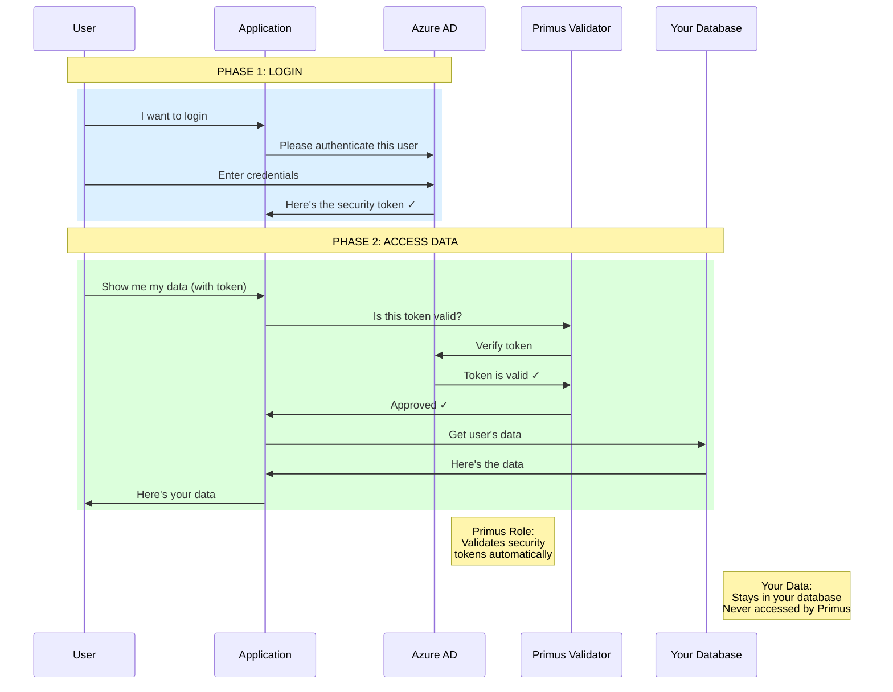

# Authentication & Validation Flow
## Simple High-Level Overview



---

## Simple Explanation

### Phase 1: Login (Blue)
1. **User** wants to access the application
2. **Application** redirects to **Azure AD** for authentication
3. **User** enters their credentials (email/password)
4. **Azure AD** confirms identity and gives a **security token** to the application

### Phase 2: Access Data (Green)
5. **User** requests their data (token included automatically)
6. **Application** asks **Primus Validator**: "Is this token valid?"
7. **Primus** checks with **Azure AD**: "Is this token authentic?"
8. **Azure AD** confirms: "Yes, it's valid ✓"
9. **Primus** tells **Application**: "Approved ✓"
10. **Application** gets data from **Your Database**
11. **Application** shows data to **User**

---

## Key Points

### What Primus Does:
✓ **Validates security tokens** - Checks if the user's login is legitimate  
✓ **Automatic verification** - No manual code needed  
✓ **Fast & secure** - Industry-standard validation  

### What Primus Does NOT Do:
✗ **Access your data** - Never touches your database  
✗ **Store user information** - Only validates tokens  
✗ **Track user activity** - Only performs validation  

---

## The Value Proposition

### Without Primus:
Your developers must:
- Write complex token validation code
- Manually check security for every request
- Keep up with security updates
- Test thoroughly for vulnerabilities

**Time:** 2-3 weeks per application  
**Risk:** High (security is hard to get right)

### With Primus:
Your developers:
- Install one package
- Add 3 lines of configuration
- Done!

**Time:** 5 minutes  
**Risk:** Low (battle-tested, production-ready)

---

## Real-World Analogy

Think of Primus like a **security guard at a building entrance**:

1. **You (User)** show your ID badge to enter
2. **Security Guard (Primus)** checks if the badge is valid
3. **Security System (Azure AD)** confirms: "Yes, that's a real badge"
4. **Security Guard** lets you in
5. **You** go to your office and access your files
6. **Security Guard** doesn't follow you or see what you do

**Primus validates your "badge" (token) but never sees your "files" (data).**

---

## For Management: The Bottom Line

### Security Without Complexity
- ✅ Enterprise-grade authentication in 5 minutes
- ✅ No security expertise required
- ✅ Automatic updates and maintenance

### Data Sovereignty
- ✅ Your data stays in your infrastructure
- ✅ Full compliance control (GDPR, HIPAA, SOC 2)
- ✅ No third-party data access

### Cost Savings
- ✅ 2-3 weeks of development time saved per app
- ✅ Reduced security risk
- ✅ Lower maintenance overhead

---

## How to Convert This to PNG

### Option 1: Online Tool (Easiest)
1. Go to https://mermaid.live/
2. Copy the Mermaid code above (between the ``` marks)
3. Paste it in the editor
4. Click "Download PNG"

### Option 2: VS Code
1. Install "Markdown Preview Mermaid Support" extension
2. Open this file
3. Preview the markdown (Ctrl+Shift+V)
4. Right-click diagram → Export as PNG

---

**Primus SaaS Platform** - *Enterprise Solutions, Developer Friendly*
