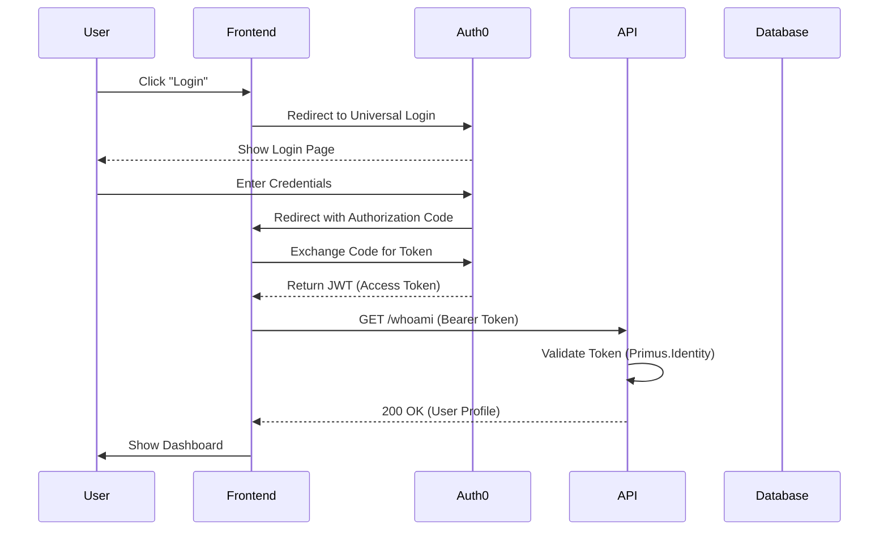
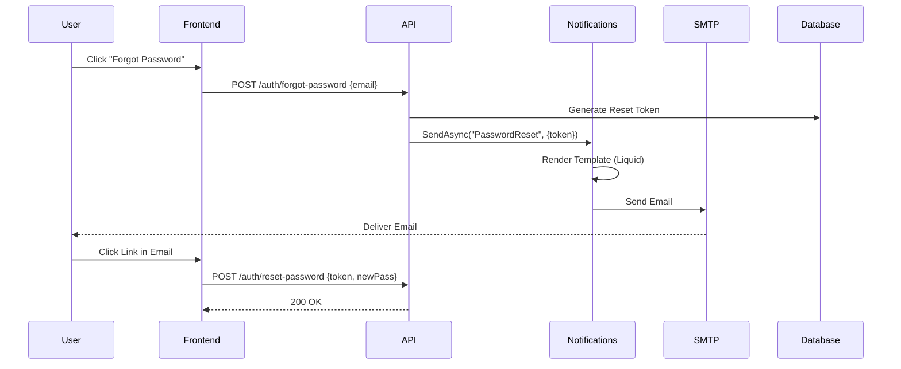

# 🎨 UI Flow Diagrams

**Tool:** Mermaid.js  
**Scope:** Core User Journeys

---

## 1. 🔐 Login Flow (Multi-Tenant)

```mermaid
sequenceDiagram
    participant User
    participant Frontend
    participant Auth0
    participant API
    participant Database

    User->>Frontend: Click "Login"
    Frontend->>Auth0: Redirect to Universal Login
    Auth0-->>User: Show Login Page
    User->>Auth0: Enter Credentials
    Auth0->>Frontend: Redirect with Authorization Code
    Frontend->>Auth0: Exchange Code for Token
    Auth0-->>Frontend: Return JWT (Access Token)
    Frontend->>API: GET /whoami (Bearer Token)
    API->>API: Validate Token (Primus.Identity)
    API-->>Frontend: 200 OK (User Profile)
    Frontend->>User: Show Dashboard
```

---

## 2. 📨 Password Reset Flow

```mermaid
sequenceDiagram
    participant User
    participant Frontend
    participant API
    participant Notifications
    participant SMTP

    User->>Frontend: Click "Forgot Password"
    Frontend->>API: POST /auth/forgot-password {email}
    API->>Database: Generate Reset Token
    API->>Notifications: SendAsync("PasswordReset", {token})
    Notifications->>Notifications: Render Template (Liquid)
    Notifications->>SMTP: Send Email
    SMTP-->>User: Deliver Email
    User->>Frontend: Click Link in Email
    Frontend->>API: POST /auth/reset-password {token, newPass}
    API-->>Frontend: 200 OK
```
