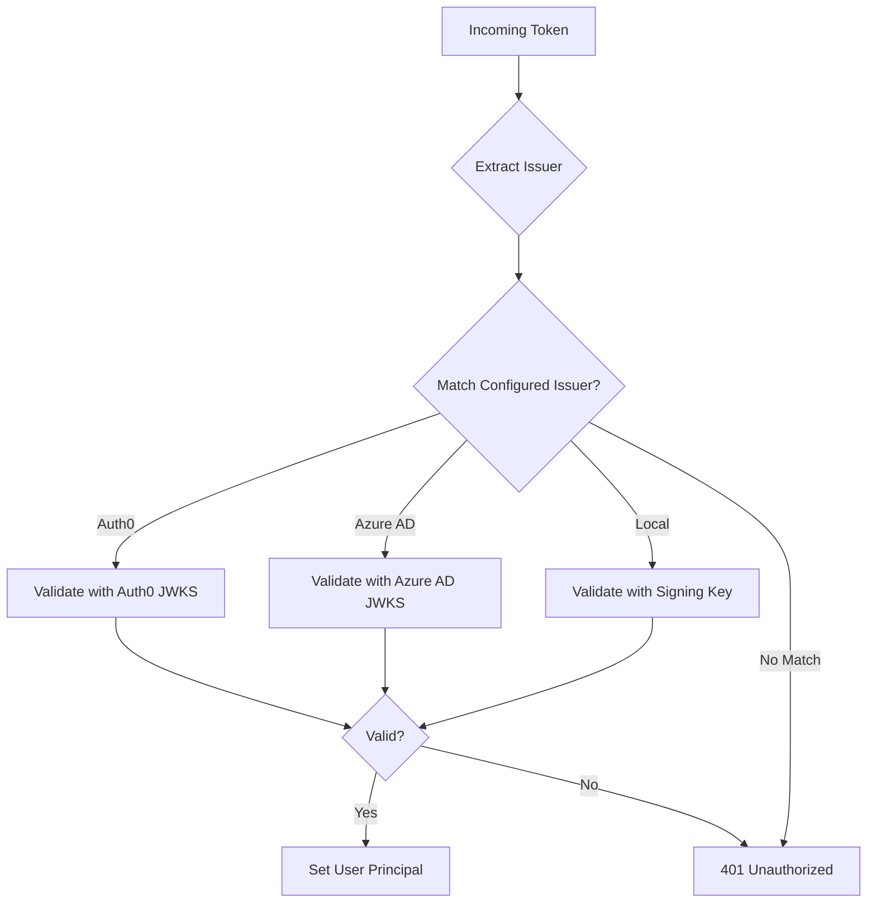

# Multi-Issuer Configuration

Accept tokens from multiple identity providers (Auth0, Azure AD, Local JWT) in a single API. Perfect for enterprise scenarios with multiple IdPs or migration between providers.

---

## Use Cases

| Scenario | Configuration |
|----------|---------------|
| Enterprise with Azure AD + partner Auth0 | Azure AD + Auth0 |
| Migration from Auth0 to Azure AD | Azure AD + Auth0 |
| Production + Dev testing | External provider + Local JWT |
| Multi-tenant SaaS | Multiple Azure AD tenants |
| Full demo (all) | Azure AD + Auth0 + Local JWT |

---

## Quick Setup: All Three Providers

### appsettings.json

```json
{
  "PrimusIdentity": {
    "RequireHttpsMetadata": true,
    "ValidateLifetime": true,
    "Issuers": [
      {
        "Name": "Auth0-Production",
        "Type": "Auth0",
        "Authority": "https://YOUR-TENANT.auth0.com/",
        "Issuer": "https://YOUR-TENANT.auth0.com/",
        "Audiences": [ "https://your-api" ]
      },
      {
        "Name": "AzureAD-Corporate",
        "Type": "AzureAD",
        "Authority": "https://login.microsoftonline.com/YOUR-TENANT-ID/v2.0",
        "Issuer": "https://login.microsoftonline.com/YOUR-TENANT-ID/v2.0",
        "Audiences": [ "api://YOUR-CLIENT-ID" ]
      },
      {
        "Name": "LocalDev",
        "Type": "Jwt",
        "Secret": "your-256-bit-secret-key-at-least-32-chars-long!!",
        "Issuer": "https://local-dev-issuer",
        "Audiences": [ "local-dev-api" ]
      }
    ],
    "Diagnostics": {
      "EnableInDevelopment": true,
      "TrackFailures": true
    }
  }
}
```

### Program.cs

```csharp
using PrimusSaaS.Identity.Validator;

var builder = WebApplication.CreateBuilder(args);

// Single line configures ALL issuers
builder.Services.AddPrimusIdentity(opts => 
    builder.Configuration.GetSection("PrimusIdentity").Bind(opts));

builder.Services.AddControllers();

var app = builder.Build();

app.UseAuthentication();
app.UseAuthorization();

app.MapControllers();
app.Run();
```

**That's it!** Primus Identity automatically validates tokens from any configured issuer.

---

## How Multi-Issuer Validation Works



1. Token arrives with `Authorization: Bearer xxx`
2. Primus extracts the `iss` (issuer) claim
3. Matches issuer to configured provider
4. Validates signature using provider's method
5. Sets `HttpContext.User` with claims

---

## Complete Working Example

```csharp
using PrimusSaaS.Identity.Validator;
using Microsoft.AspNetCore.Authorization;
using Microsoft.AspNetCore.Mvc;

var builder = WebApplication.CreateBuilder(args);

// Configure multi-issuer authentication
builder.Services.AddPrimusIdentity(opts => 
    builder.Configuration.GetSection("PrimusIdentity").Bind(opts));

builder.Services.AddEndpointsApiExplorer();
builder.Services.AddSwaggerGen();

var app = builder.Build();

app.UseSwagger();
app.UseSwaggerUI();
app.UseAuthentication();
app.UseAuthorization();

// Health check
app.MapGet("/", () => new { 
    status = "healthy", 
    auth = "Multi-Issuer (Auth0 + Azure AD + Local)" 
});

// Works with ANY configured issuer
app.MapGet("/me", [Authorize] (HttpContext ctx) =>
{
    // Detect which issuer authenticated this request
    var issuer = ctx.User.FindFirst("iss")?.Value ?? "unknown";
    var provider = DetectProvider(issuer);
    
    return new {
        provider,
        issuer,
        userId = ctx.User.FindFirst("sub")?.Value,
        email = GetEmail(ctx.User, provider),
        name = GetName(ctx.User, provider)
    };
});

// Show all claims (debugging)
app.MapGet("/debug/claims", [Authorize] (HttpContext ctx) =>
{
    var issuer = ctx.User.FindFirst("iss")?.Value;
    return new {
        issuer,
        provider = DetectProvider(issuer),
        claims = ctx.User.Claims.Select(c => new { c.Type, c.Value })
    };
});

// Provider-specific endpoint example
app.MapGet("/azure-only", [Authorize] (HttpContext ctx) =>
{
    var issuer = ctx.User.FindFirst("iss")?.Value ?? "";
    if (!issuer.Contains("microsoftonline"))
    {
        return Results.Forbid();
    }
    return Results.Ok(new { message = "Azure AD users only!" });
});

app.Run();

// Helper methods
string DetectProvider(string? issuer)
{
    if (string.IsNullOrEmpty(issuer)) return "unknown";
    if (issuer.Contains("auth0")) return "Auth0";
    if (issuer.Contains("microsoftonline") || issuer.Contains("sts.windows.net")) return "AzureAD";
    if (issuer.Contains("local")) return "Local";
    return "unknown";
}

string? GetEmail(ClaimsPrincipal user, string provider)
{
    return provider switch
    {
        "AzureAD" => user.FindFirst("preferred_username")?.Value ?? user.FindFirst("email")?.Value,
        "Auth0" => user.FindFirst("email")?.Value,
        "Local" => user.FindFirst("email")?.Value,
        _ => user.FindFirst("email")?.Value
    };
}

string? GetName(ClaimsPrincipal user, string provider)
{
    return user.FindFirst("name")?.Value;
}
```

---

## Configuration Patterns

### Pattern 1: Production + Development

```json
{
  "PrimusIdentity": {
    "Issuers": [
      {
        "Name": "Auth0-Prod",
        "Type": "Auth0",
        "Authority": "https://prod-tenant.auth0.com/",
        "Issuer": "https://prod-tenant.auth0.com/",
        "Audiences": [ "https://api.example.com" ],
        "AllowMachineToMachine": true
      },
      {
        "Name": "LocalDev",
        "Type": "Jwt",
        "Secret": "dev-secret-key-at-least-32-characters!!",
        "Issuer": "https://local-dev",
        "Audiences": [ "local-api" ]
      }
    ]
  }
}
```

**Use case:** Production uses Auth0, developers can test with local tokens.

---

### Pattern 2: Enterprise Migration

```json
{
  "PrimusIdentity": {
    "Issuers": [
      {
        "Name": "Auth0-Legacy",
        "Type": "Auth0",
        "Authority": "https://legacy.auth0.com/",
        "Issuer": "https://legacy.auth0.com/",
        "Audiences": [ "https://api.example.com" ],
        "AllowMachineToMachine": true
      },
      {
        "Name": "AzureAD-New",
        "Type": "AzureAD",
        "Authority": "https://login.microsoftonline.com/new-tenant-id/v2.0",
        "Issuer": "https://login.microsoftonline.com/new-tenant-id/v2.0",
        "Audiences": [ "api://new-client-id" ]
      }
    ]
  }
}
```

**Use case:** Migrating from Auth0 to Azure AD while supporting both.

---

### Pattern 3: Multi-Tenant SaaS

```json
{
  "PrimusIdentity": {
    "Issuers": [
      {
        "Name": "Tenant-Acme",
        "Type": "AzureAD",
        "Authority": "https://login.microsoftonline.com/acme-tenant-id/v2.0",
        "Issuer": "https://login.microsoftonline.com/acme-tenant-id/v2.0",
        "Audiences": [ "api://app-client-id" ]
      },
      {
        "Name": "Tenant-Contoso",
        "Type": "AzureAD",
        "Authority": "https://login.microsoftonline.com/contoso-tenant-id/v2.0",
        "Issuer": "https://login.microsoftonline.com/contoso-tenant-id/v2.0",
        "Audiences": [ "api://app-client-id" ]
      },
      {
        "Name": "Tenant-Fabrikam",
        "Type": "Auth0",
        "Authority": "https://fabrikam.auth0.com/",
        "Issuer": "https://fabrikam.auth0.com/",
        "Audiences": [ "https://api.saas.com" ]
      }
    ]
  }
}
```

**Use case:** Different enterprise customers using different IdPs.

---

### Pattern 4: B2B with Partner Access

```json
{
  "PrimusIdentity": {
    "Issuers": [
      {
        "Name": "Internal-AzureAD",
        "Type": "AzureAD",
        "Authority": "https://login.microsoftonline.com/our-tenant-id/v2.0",
        "Issuer": "https://login.microsoftonline.com/our-tenant-id/v2.0",
        "Audiences": [ "api://internal-app-id" ]
      },
      {
        "Name": "Partner-Auth0",
        "Type": "Auth0",
        "Authority": "https://partner.auth0.com/",
        "Issuer": "https://partner.auth0.com/",
        "Audiences": [ "https://partner-api" ]
      }
    ]
  }
}
```

**Use case:** Internal users via Azure AD, external partners via Auth0.

---

## Environment-Based Configuration

### appsettings.json (Base)

```json
{
  "PrimusIdentity": {
    "DefaultScheme": "Bearer"
  }
}
```

### appsettings.Development.json

```json
{
  "PrimusIdentity": {
    "EnableDetailedErrors": true,
    "Issuers": [
      {
        "Name": "LocalDev",
        "Type": "Jwt",
        "Secret": "dev-secret-key-at-least-32-characters!!",
        "Issuer": "https://local-dev",
        "Audiences": [ "local-api" ]
      }
    ]
  }
}
```

### appsettings.Production.json

```json
{
  "PrimusIdentity": {
    "EnableDetailedErrors": false,
    "Issuers": [
      {
        "Name": "Auth0",
        "Type": "Auth0",
        "Authority": "https://prod.auth0.com/",
        "Issuer": "https://prod.auth0.com/",
        "Audiences": [ "https://api.example.com" ]
      },
      {
        "Name": "AzureAD",
        "Type": "AzureAD",
        "Authority": "https://login.microsoftonline.com/prod-tenant-id/v2.0",
        "Issuer": "https://login.microsoftonline.com/prod-tenant-id/v2.0",
        "Audiences": [ "api://prod-client-id" ]
      }
    ]
  }
}
```

---

## Testing Multi-Issuer

```csharp
[Fact]
public async Task Api_AcceptsAuth0Token()
{
    var token = GetAuth0TestToken();  // From Auth0 dashboard
    _client.DefaultRequestHeaders.Authorization = 
        new AuthenticationHeaderValue("Bearer", token);

    var response = await _client.GetAsync("/me");
    
    Assert.Equal(HttpStatusCode.OK, response.StatusCode);
    var body = await response.Content.ReadFromJsonAsync<UserInfo>();
    Assert.Equal("Auth0", body.Provider);
}

[Fact]
public async Task Api_AcceptsAzureAdToken()
{
    var token = GetAzureAdTestToken();  // From Azure CLI
    _client.DefaultRequestHeaders.Authorization = 
        new AuthenticationHeaderValue("Bearer", token);

    var response = await _client.GetAsync("/me");
    
    Assert.Equal(HttpStatusCode.OK, response.StatusCode);
    var body = await response.Content.ReadFromJsonAsync<UserInfo>();
    Assert.Equal("AzureAD", body.Provider);
}

[Fact]
public async Task Api_AcceptsLocalToken()
{
    var token = TestTokenGenerator.GenerateToken();
    _client.DefaultRequestHeaders.Authorization = 
        new AuthenticationHeaderValue("Bearer", token);

    var response = await _client.GetAsync("/me");
    
    Assert.Equal(HttpStatusCode.OK, response.StatusCode);
    var body = await response.Content.ReadFromJsonAsync<UserInfo>();
    Assert.Equal("Local", body.Provider);
}

[Fact]
public async Task Api_RejectsUnknownIssuer()
{
    var token = CreateTokenWithUnknownIssuer();
    _client.DefaultRequestHeaders.Authorization = 
        new AuthenticationHeaderValue("Bearer", token);

    var response = await _client.GetAsync("/me");
    
    Assert.Equal(HttpStatusCode.Unauthorized, response.StatusCode);
}
```

---

## Troubleshooting

### Error: "IDX10501: Signature validation failed"

**Cause:** Token from unconfigured issuer.

**Debug:**
```csharp
var handler = new JwtSecurityTokenHandler();
var jwt = handler.ReadJwtToken(token);
Console.WriteLine($"Token issuer: {jwt.Issuer}");
// Compare with configured issuers
```

### Error: Tokens from one provider work, others don't

**Cause:** Configuration mismatch.

**Checklist:**
1. ✅ Authority URL correct for each provider
2. ✅ Audience matches token's `aud` claim
3. ✅ For Azure AD: correct TenantId and ClientId
4. ✅ For Local: signing key matches

### Error: "Multiple authentication schemes configured but none selected"

**Cause:** Missing `DefaultScheme`.

**Solution:**
```json
{
  "PrimusIdentity": {
    "DefaultScheme": "Bearer",
    "Issuers": [...]
  }
}
```

---

## Next Steps

| Want to... | See Guide |
|------------|-----------|
| Swagger integration & diagnostics | [Advanced Features →](/docs/modules/identity-advanced) |
| Provider-specific setup | [Auth0 →](/docs/modules/identity-auth0) • [Azure AD →](/docs/modules/identity-azure-ad) • [Local →](/docs/modules/identity-local-jwt) |
| Full API reference | [Identity Validator Reference →](/docs/modules/identity-validator) |


