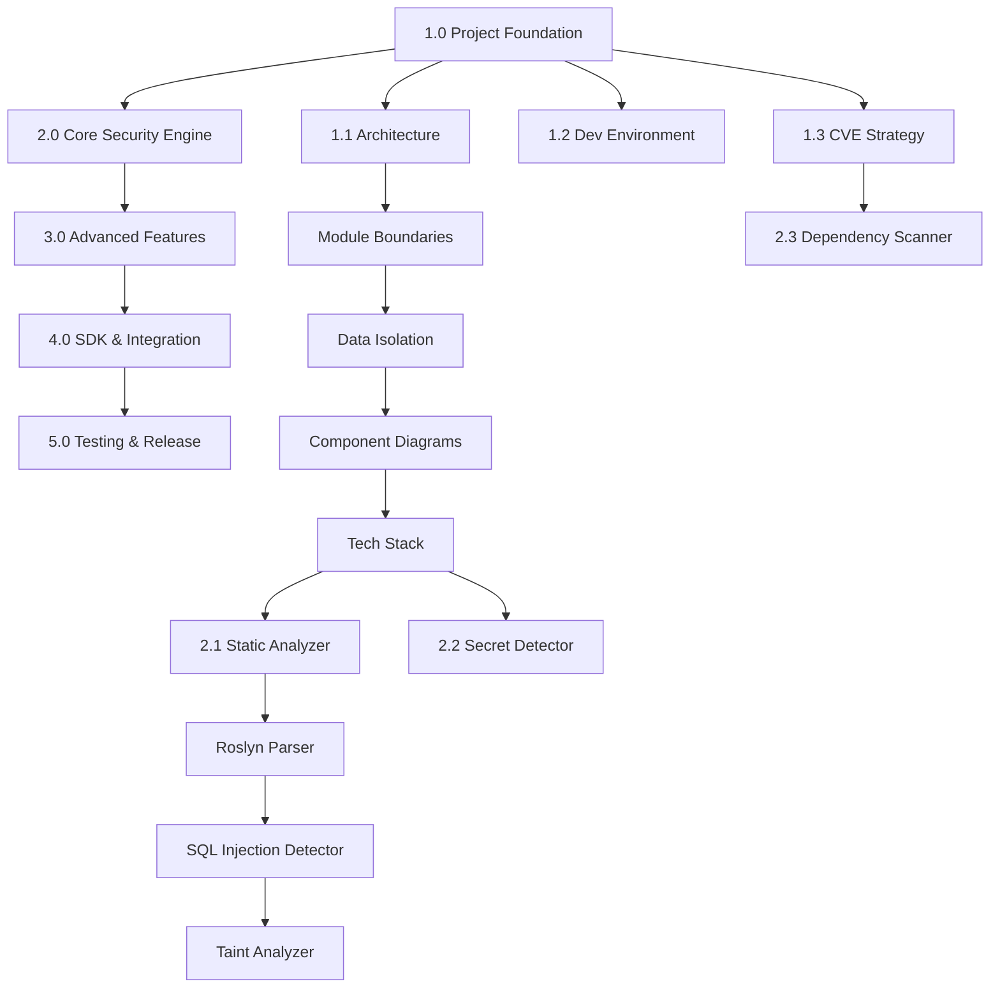

# PrimusSaaS.Security - Work Breakdown Structure (WBS)

**Version**: 1.0  
**Date**: December 3, 2025  
**Purpose**: Granular implementation plan with resources, dependencies, and prerequisites

---

## 📊 WBS Legend

```
Level 1 (L1): Major Phase
├─ Level 2 (L2): Component/Feature
│  ├─ Level 3 (L3): Sub-component/Task
│  │  └─ Level 4 (L4): Granular Implementation Step
│     ├─ 👥 Resources: Who/What is needed
│     ├─ 📦 Dependencies: What must exist first
│     ├─ ✅ Prerequisites: Required skills/tools/knowledge
│     └─ ⏱️ Duration: Time estimate
```

---

## 🗂️ MASTER WBS TREE

```
PrimusSaaS.Security Module (100%)
│
├─ 1.0 PROJECT FOUNDATION (10%) - Weeks 1-2
│  ├─ 1.1 Architecture & Design
│  ├─ 1.2 Development Environment Setup
│  └─ 1.3 CVE Data Strategy
│
├─ 2.0 CORE SECURITY ENGINE (40%) - Weeks 3-10
│  ├─ 2.1 Static Code Analyzer
│  ├─ 2.2 Secret Detection Engine
│  ├─ 2.3 Dependency Scanner
│  └─ 2.4 Security Policy Engine
│
├─ 3.0 ADVANCED FEATURES (30%) - Weeks 11-18
│  ├─ 3.1 Taint Analysis Engine
│  ├─ 3.2 Penetration Testing Simulator
│  ├─ 3.3 Compliance Reporter
│  └─ 3.4 Threat Modeling
│
├─ 4.0 SDK & INTEGRATION (10%) - Weeks 19-22
│  ├─ 4.1 .NET SDK Package
│  ├─ 4.2 Node.js SDK Package
│  └─ 4.3 Portal Integration
│
└─ 5.0 TESTING & RELEASE (10%) - Weeks 23-26
   ├─ 5.1 Unit Testing
   ├─ 5.2 Integration Testing
   ├─ 5.3 Beta Program
   └─ 5.4 Production Release
```

---

## 📋 DETAILED WBS WITH MAPPINGS

---

## 1.0 PROJECT FOUNDATION (Weeks 1-2)

### 1.1 Architecture & Design

#### 1.1.1 Technical Architecture Document

**📍 Granular Tasks**:

##### L4: Define Module Boundaries
- **Task**: Document what's in-scope vs out-of-scope
- **👥 Resources**: 
  - Solution Architect (8 hours)
  - Product Manager (4 hours)
- **📦 Dependencies**: None (first task)
- **✅ Prerequisites**:
  - Understanding of Primus platform architecture
  - Knowledge of existing modules (Identity, Logging, Notifications)
- **⏱️ Duration**: 1 day
- **📄 Output**: `ARCHITECTURE_BOUNDARIES.md`

##### L4: Design Data Isolation Model
- **Task**: Define how to guarantee zero external calls
- **👥 Resources**:
  - Solution Architect (16 hours)
  - Security Engineer (8 hours)
- **📦 Dependencies**: 
  - Module boundaries defined (1.1.1.1)
- **✅ Prerequisites**:
  - Expertise in secure architecture design
  - Understanding of .NET assembly loading
  - Knowledge of compile-time restrictions
- **⏱️ Duration**: 2 days
- **📄 Output**: `DATA_ISOLATION_DESIGN.md`

##### L4: Component Interaction Diagram
- **Task**: Create diagrams showing how components interact
- **👥 Resources**:
  - Solution Architect (8 hours)
  - Technical Writer (4 hours)
- **📦 Dependencies**:
  - Architecture boundaries (1.1.1.1)
  - Data isolation model (1.1.1.2)
- **✅ Prerequisites**:
  - Diagramming tools (Draw.io, Mermaid)
  - UML knowledge
- **⏱️ Duration**: 1 day
- **📄 Output**: `COMPONENT_DIAGRAMS.md`

##### L4: Technology Stack Selection
- **Task**: Choose libraries for AST parsing, SQLite, PDF generation
- **👥 Resources**:
  - Solution Architect (8 hours)
  - Senior Engineer .NET (4 hours)
  - Senior Engineer Node.js (4 hours)
- **📦 Dependencies**:
  - Component interactions defined (1.1.1.3)
- **✅ Prerequisites**:
  - Evaluation of library licenses (must be compatible)
  - Performance benchmarks
  - Security audit of third-party libraries
- **⏱️ Duration**: 1 day
- **📄 Output**: `TECHNOLOGY_STACK.md`

**Technology Selections**:
```yaml
dotnet:
  ast_parser: Microsoft.CodeAnalysis.CSharp (Roslyn)
  database: Microsoft.Data.Sqlite
  pdf_generation: QuestPDF
  template_engine: Fluid.Core (already used in Notifications)
  compression: ZstdSharp (for CVE database)

nodejs:
  ast_parser: "@typescript-eslint/parser"
  database: better-sqlite3
  pdf_generation: pdfkit
  template_engine: liquidjs
  compression: zstd-codec
```

---

#### 1.1.2 Security Analysis Rules Library Design

##### L4: OWASP Top 10 Mapping
- **Task**: Map OWASP Top 10 to detectable patterns
- **👥 Resources**:
  - Security Engineer (16 hours)
  - Solution Architect (8 hours)
- **📦 Dependencies**:
  - Technology stack selected (1.1.1.4)
- **✅ Prerequisites**:
  - Deep understanding of OWASP Top 10 2021
  - Knowledge of common vulnerability patterns
  - Experience with static analysis
- **⏱️ Duration**: 2 days
- **📄 Output**: `OWASP_RULE_MAPPING.yaml`

**Example Output**:
```yaml
owasp_top_10:
  A01_broken_access_control:
    - rule_id: BAC001
      pattern: "Authorization bypass - missing [Authorize] attribute"
      detection_method: AST_ATTRIBUTE_ANALYSIS
    - rule_id: BAC002
      pattern: "Insecure direct object reference"
      detection_method: TAINT_ANALYSIS
      
  A03_injection:
    - rule_id: INJ001
      pattern: "SQL injection - string concatenation in query"
      detection_method: TAINT_ANALYSIS
    - rule_id: INJ002
      pattern: "XSS - unescaped user input in view"
      detection_method: DATA_FLOW_ANALYSIS
```

##### L4: CWE Database Schema
- **Task**: Design database schema for Common Weakness Enumeration
- **👥 Resources**:
  - Database Engineer (8 hours)
  - Security Engineer (4 hours)
- **📦 Dependencies**:
  - OWASP mapping complete (1.1.2.1)
- **✅ Prerequisites**:
  - Understanding of CWE taxonomy
  - SQL schema design expertise
  - SQLite optimization knowledge
- **⏱️ Duration**: 1 day
- **📄 Output**: `CWE_SCHEMA.sql`

**Schema Design**:
```sql
-- CWE Database Schema
CREATE TABLE cwe_definitions (
    id INTEGER PRIMARY KEY,
    cwe_id TEXT NOT NULL UNIQUE, -- e.g., "CWE-89"
    name TEXT NOT NULL,
    description TEXT,
    extended_description TEXT,
    related_attack_patterns TEXT, -- JSON array
    owasp_mapping TEXT, -- e.g., "A03:2021"
    severity_score REAL
);

CREATE TABLE detection_rules (
    id INTEGER PRIMARY KEY,
    rule_id TEXT NOT NULL UNIQUE,
    cwe_id TEXT NOT NULL,
    language TEXT NOT NULL, -- 'csharp', 'typescript', etc.
    pattern_type TEXT NOT NULL, -- 'REGEX', 'AST', 'TAINT', 'DATA_FLOW'
    pattern_definition TEXT NOT NULL, -- JSON or regex
    severity TEXT NOT NULL, -- 'LOW', 'MEDIUM', 'HIGH', 'CRITICAL'
    false_positive_rate REAL,
    FOREIGN KEY (cwe_id) REFERENCES cwe_definitions(cwe_id)
);

CREATE INDEX idx_cwe_severity ON cwe_definitions(severity_score);
CREATE INDEX idx_rules_language ON detection_rules(language);
CREATE INDEX idx_rules_cwe ON detection_rules(cwe_id);
```

##### L4: Secret Pattern Library
- **Task**: Create database of known secret formats
- **👥 Resources**:
  - Security Engineer (16 hours)
  - Research Assistant (8 hours)
- **📦 Dependencies**:
  - CWE schema designed (1.1.2.2)
- **✅ Prerequisites**:
  - Research on common secret formats (AWS, GitHub, Stripe, etc.)
  - Regex expertise
  - Understanding of entropy-based detection
- **⏱️ Duration**: 2 days
- **📄 Output**: `SECRET_PATTERNS.json`

**Pattern Library Example**:
```json
{
  "secret_patterns": [
    {
      "id": "SEC001",
      "type": "AWS Access Key",
      "provider": "Amazon Web Services",
      "pattern": "AKIA[0-9A-Z]{16}",
      "entropy_threshold": null,
      "severity": "CRITICAL",
      "url_reference": "https://aws.amazon.com/premiumsupport/knowledge-center/security-access-keys/"
    },
    {
      "id": "SEC002",
      "type": "GitHub Personal Access Token",
      "provider": "GitHub",
      "pattern": "ghp_[a-zA-Z0-9]{36}",
      "entropy_threshold": null,
      "severity": "CRITICAL"
    },
    {
      "id": "SEC003",
      "type": "Generic High-Entropy String",
      "provider": "Unknown",
      "pattern": "[a-zA-Z0-9+/]{40,}",
      "entropy_threshold": 4.5,
      "severity": "MEDIUM"
    }
  ]
}
```

---

### 1.2 Development Environment Setup

#### 1.2.1 Repository Structure

##### L4: Create Git Repository
- **Task**: Initialize repository with folder structure
- **👥 Resources**:
  - DevOps Engineer (2 hours)
- **📦 Dependencies**: None
- **✅ Prerequisites**:
  - Access to GitHub/Azure DevOps
  - Repository naming convention defined
- **⏱️ Duration**: 0.5 days
- **📄 Output**: Repository at `https://github.com/primus-saas/security`

**Repository Structure**:
```
primus-security/
├── src/
│   ├── dotnet/
│   │   ├── PrimusSaaS.Security/
│   │   ├── PrimusSaaS.Security.Analyzers/
│   │   ├── PrimusSaaS.Security.Rules/
│   │   └── PrimusSaaS.Security.Data/
│   ├── nodejs/
│   │   └── packages/
│   │       └── security/
│   └── shared/
│       ├── rules/
│       ├── patterns/
│       └── schemas/
├── data/
│   ├── cve-database/
│   ├── cwe-definitions/
│   └── secret-patterns/
├── tests/
│   ├── unit/
│   ├── integration/
│   └── fixtures/
├── docs/
├── tools/
└── .github/
    └── workflows/
```

##### L4: CI/CD Pipeline Setup
- **Task**: Configure automated build and test pipeline
- **👥 Resources**:
  - DevOps Engineer (8 hours)
  - Senior Engineer .NET (4 hours)
- **📦 Dependencies**:
  - Repository created (1.2.1.1)
- **✅ Prerequisites**:
  - GitHub Actions or Azure DevOps Pipelines knowledge
  - Understanding of .NET and Node.js build processes
- **⏱️ Duration**: 1 day
- **📄 Output**: `.github/workflows/ci.yml`

**CI/CD Pipeline**:
```yaml
# .github/workflows/ci.yml
name: CI/CD Pipeline

on:
  push:
    branches: [main, develop]
  pull_request:
    branches: [main]

jobs:
  build-dotnet:
    runs-on: ubuntu-latest
    steps:
      - uses: actions/checkout@v3
      
      - name: Setup .NET
        uses: actions/setup-dotnet@v3
        with:
          dotnet-version: '8.0.x'
      
      - name: Restore dependencies
        run: dotnet restore src/dotnet/PrimusSaaS.Security.sln
      
      - name: Build
        run: dotnet build src/dotnet/PrimusSaaS.Security.sln --no-restore
      
      - name: Run unit tests
        run: dotnet test tests/unit/dotnet/ --no-build --verbosity normal
      
      - name: Verify no network references
        run: dotnet run --project tools/NetworkReferenceChecker
      
      - name: Pack NuGet
        run: dotnet pack src/dotnet/PrimusSaaS.Security -o artifacts/
      
      - name: Upload artifacts
        uses: actions/upload-artifact@v3
        with:
          name: nuget-packages
          path: artifacts/*.nupkg

  build-nodejs:
    runs-on: ubuntu-latest
    steps:
      - uses: actions/checkout@v3
      
      - name: Setup Node.js
        uses: actions/setup-node@v3
        with:
          node-version: '18.x'
      
      - name: Install dependencies
        run: npm ci
        working-directory: src/nodejs
      
      - name: Build
        run: npm run build
        working-directory: src/nodejs
      
      - name: Run unit tests
        run: npm test
        working-directory: src/nodejs
      
      - name: Pack NPM
        run: npm pack
        working-directory: src/nodejs/packages/security
```

##### L4: Development Docker Environment
- **Task**: Create containerized dev environment
- **👥 Resources**:
  - DevOps Engineer (4 hours)
- **📦 Dependencies**:
  - Repository structure created (1.2.1.1)
- **✅ Prerequisites**:
  - Docker expertise
  - Understanding of development workflow
- **⏱️ Duration**: 0.5 days
- **📄 Output**: `docker-compose.dev.yml`

---

#### 1.2.2 Development Tools & IDE Setup

##### L4: VS Code Extensions Configuration
- **Task**: Create recommended extensions file
- **👥 Resources**:
  - Senior Engineer .NET (2 hours)
  - Senior Engineer Node.js (2 hours)
- **📦 Dependencies**:
  - Repository created (1.2.1.1)
- **✅ Prerequisites**:
  - Knowledge of productivity tools
- **⏱️ Duration**: 0.5 days
- **📄 Output**: `.vscode/extensions.json`

##### L4: Code Style & Linting Rules
- **Task**: Configure EditorConfig, ESLint, Roslyn Analyzers
- **👥 Resources**:
  - Senior Engineer .NET (4 hours)
  - Senior Engineer Node.js (4 hours)
- **📦 Dependencies**:
  - Repository created (1.2.1.1)
- **✅ Prerequisites**:
  - Team coding standards agreement
- **⏱️ Duration**: 1 day
- **📄 Output**: `.editorconfig`, `eslint.config.js`, `Directory.Build.props`

---

### 1.3 CVE Data Strategy

#### 1.3.1 CVE Data Sourcing

##### L4: NVD API Integration
- **Task**: Build scraper for National Vulnerability Database
- **👥 Resources**:
  - Senior Engineer .NET (16 hours)
  - Data Engineer (8 hours)
- **📦 Dependencies**:
  - Database schema designed (1.1.2.2)
- **✅ Prerequisites**:
  - NVD API key (free, registration required)
  - Understanding of NVD JSON feed format
  - Rate limiting knowledge
- **⏱️ Duration**: 2 days
- **📄 Output**: `tools/NvdScraper/`

**Implementation**:
```csharp
// tools/NvdScraper/NvdApiClient.cs
public class NvdApiClient
{
    private readonly HttpClient _httpClient;
    private readonly string _apiKey;
    
    // Rate limit: 5 requests per 30 seconds with API key
    private readonly SemaphoreSlim _rateLimiter = new(5, 5);
    
    public async Task<List<CveItem>> FetchCvesAsync(
        DateTime startDate,
        DateTime endDate)
    {
        var cves = new List<CveItem>();
        var startIndex = 0;
        const int resultsPerPage = 2000;
        
        while (true)
        {
            await _rateLimiter.WaitAsync();
            var releaseTime = DateTime.UtcNow.AddSeconds(30);
            
            var url = $"https://services.nvd.nist.gov/rest/json/cves/2.0?" +
                     $"pubStartDate={startDate:yyyy-MM-ddTHH:mm:ss.fffZ}&" +
                     $"pubEndDate={endDate:yyyy-MM-ddTHH:mm:ss.fffZ}&" +
                     $"startIndex={startIndex}&" +
                     $"resultsPerPage={resultsPerPage}";
            
            var response = await _httpClient.GetAsync(url);
            var data = await response.Content.ReadFromJsonAsync<NvdResponse>();
            
            cves.AddRange(data.Vulnerabilities.Select(v => v.Cve));
            
            if (cves.Count >= data.TotalResults)
                break;
                
            startIndex += resultsPerPage;
            
            // Schedule rate limit reset
            _ = Task.Delay(30000).ContinueWith(_ => _rateLimiter.Release());
        }
        
        return cves;
    }
}
```

##### L4: GitHub Advisory Database Integration
- **Task**: Build scraper for GitHub Security Advisories
- **👥 Resources**:
  - Senior Engineer .NET (12 hours)
- **📦 Dependencies**:
  - NVD scraper complete (1.3.1.1)
- **✅ Prerequisites**:
  - GitHub API token
  - Understanding of GraphQL
- **⏱️ Duration**: 1.5 days
- **📄 Output**: `tools/GitHubAdvisoryScraper/`

##### L4: NuGet Advisory Integration
- **Task**: Scrape NuGet Security Advisories
- **👥 Resources**:
  - Senior Engineer .NET (8 hours)
- **📦 Dependencies**:
  - GitHub scraper complete (1.3.1.2)
- **✅ Prerequisites**:
  - Understanding of NuGet audit API
- **⏱️ Duration**: 1 day
- **📄 Output**: `tools/NuGetAdvisoryScraper/`

##### L4: NPM Advisory Integration
- **Task**: Scrape NPM Security Advisories
- **👥 Resources**:
  - Senior Engineer Node.js (8 hours)
- **📦 Dependencies**:
  - NuGet scraper complete (1.3.1.3)
- **✅ Prerequisites**:
  - Understanding of NPM audit API
- **⏱️ Duration**: 1 day
- **📄 Output**: `tools/NpmAdvisoryScraper/`

---

#### 1.3.2 CVE Database Builder

##### L4: Data Aggregation Pipeline
- **Task**: Combine data from all sources, deduplicate
- **👥 Resources**:
  - Data Engineer (16 hours)
  - Senior Engineer .NET (8 hours)
- **📦 Dependencies**:
  - All scrapers complete (1.3.1.1-4)
- **✅ Prerequisites**:
  - Data normalization expertise
  - Understanding of deduplication algorithms
- **⏱️ Duration**: 2 days
- **📄 Output**: `tools/CveAggregator/`

**Aggregation Logic**:
```csharp
public class CveAggregator
{
    public async Task<List<NormalizedCve>> AggregateAsync()
    {
        // 1. Fetch from all sources
        var nvdCves = await _nvdScraper.FetchAsync();
        var githubCves = await _githubScraper.FetchAsync();
        var nugetCves = await _nugetScraper.FetchAsync();
        var npmCves = await _npmScraper.FetchAsync();
        
        // 2. Normalize to common format
        var normalized = new List<NormalizedCve>();
        normalized.AddRange(nvdCves.Select(NormalizeCve));
        normalized.AddRange(githubCves.Select(NormalizeCve));
        normalized.AddRange(nugetCves.Select(NormalizeCve));
        normalized.AddRange(npmCves.Select(NormalizeCve));
        
        // 3. Deduplicate by CVE ID
        var deduplicated = normalized
            .GroupBy(c => c.CveId)
            .Select(g => MergeDuplicates(g.ToList()))
            .ToList();
        
        // 4. Enrich with additional data
        foreach (var cve in deduplicated)
        {
            await EnrichCveAsync(cve);
        }
        
        return deduplicated;
    }
    
    private NormalizedCve MergeDuplicates(List<NormalizedCve> duplicates)
    {
        // Merge logic: prefer most recent, most detailed
        return duplicates
            .OrderByDescending(c => c.LastModified)
            .ThenByDescending(c => c.Description?.Length ?? 0)
            .First();
    }
}
```

##### L4: SQLite Database Generation
- **Task**: Generate optimized SQLite database
- **👥 Resources**:
  - Data Engineer (8 hours)
- **📦 Dependencies**:
  - Aggregation pipeline complete (1.3.2.1)
- **✅ Prerequisites**:
  - SQLite optimization knowledge
  - Understanding of indexing strategies
- **⏱️ Duration**: 1 day
- **📄 Output**: `cve-database.db`

**Database Generation**:
```csharp
public class DatabaseBuilder
{
    public async Task BuildDatabaseAsync(
        List<NormalizedCve> cves,
        string outputPath)
    {
        using var connection = new SqliteConnection($"Data Source={outputPath}");
        await connection.OpenAsync();
        
        // 1. Create schema
        await CreateSchemaAsync(connection);
        
        // 2. Insert data in batches
        const int batchSize = 1000;
        for (int i = 0; i < cves.Count; i += batchSize)
        {
            var batch = cves.Skip(i).Take(batchSize).ToList();
            await InsertBatchAsync(connection, batch);
        }
        
        // 3. Create indexes
        await CreateIndexesAsync(connection);
        
        // 4. Analyze for query optimization
        var cmd = connection.CreateCommand();
        cmd.CommandText = "ANALYZE;";
        await cmd.ExecuteNonQueryAsync();
        
        // 5. Vacuum to reclaim space
        cmd.CommandText = "VACUUM;";
        await cmd.ExecuteNonQueryAsync();
    }
}
```

##### L4: Database Compression
- **Task**: Compress database using Zstandard
- **👥 Resources**:
  - Data Engineer (4 hours)
- **📦 Dependencies**:
  - Database generated (1.3.2.2)
- **✅ Prerequisites**:
  - Zstandard library knowledge
  - Compression optimization
- **⏱️ Duration**: 0.5 days
- **📄 Output**: `cve-database.db.zst`

##### L4: Automated Weekly Build
- **Task**: Schedule automated CVE database updates
- **👥 Resources**:
  - DevOps Engineer (8 hours)
- **📦 Dependencies**:
  - All build steps complete (1.3.2.1-3)
- **✅ Prerequisites**:
  - GitHub Actions scheduled workflows
- **⏱️ Duration**: 1 day
- **📄 Output**: `.github/workflows/cve-database-update.yml`

---

## 2.0 CORE SECURITY ENGINE (Weeks 3-10)

### 2.1 Static Code Analyzer

#### 2.1.1 AST Parser Integration (.NET)

##### L4: Roslyn Integration
- **Task**: Integrate Microsoft.CodeAnalysis.CSharp
- **👥 Resources**:
  - Senior Engineer .NET (16 hours)
- **📦 Dependencies**:
  - Project foundation complete (1.0)
- **✅ Prerequisites**:
  - Deep understanding of Roslyn API
  - Knowledge of C# syntax trees
  - Performance optimization expertise
- **⏱️ Duration**: 2 days
- **📄 Output**: `PrimusSaaS.Security.Analyzers/RoslynParser.cs`

**Implementation**:
```csharp
public class RoslynParser : ICodeParser
{
    public async Task<SyntaxTree> ParseAsync(string sourceCode, string filePath)
    {
        // Parse source code to syntax tree
        var tree = CSharpSyntaxTree.ParseText(
            sourceCode,
            path: filePath,
            options: new CSharpParseOptions(
                kind: SourceCodeKind.Regular,
                languageVersion: LanguageVersion.Latest
            )
        );
        
        // Perform semantic analysis
        var compilation = CSharpCompilation.Create(
            "SecurityAnalysis",
            syntaxTrees: new[] { tree },
            references: GetMetadataReferences()
        );
        
        var semanticModel = compilation.GetSemanticModel(tree);
        
        return new ParsedSyntaxTree
        {
            Tree = tree,
            SemanticModel = semanticModel,
            FilePath = filePath
        };
    }
    
    private IEnumerable<MetadataReference> GetMetadataReferences()
    {
        // Add references for common assemblies
        var assemblyPath = Path.GetDirectoryName(typeof(object).Assembly.Location);
        
        return new[]
        {
            MetadataReference.CreateFromFile(Path.Combine(assemblyPath, "mscorlib.dll")),
            MetadataReference.CreateFromFile(Path.Combine(assemblyPath, "System.dll")),
            MetadataReference.CreateFromFile(Path.Combine(assemblyPath, "System.Core.dll")),
            MetadataReference.CreateFromFile(Path.Combine(assemblyPath, "System.Data.dll")),
            // Add more as needed
        };
    }
}
```

**📦 Dependencies**:
```xml
<PackageReference Include="Microsoft.CodeAnalysis.CSharp" Version="4.8.0" />
```

**✅ Prerequisites**:
- Roslyn documentation review
- Performance profiling tools
- Understanding of syntax tree traversal

---

##### L4: TypeScript AST Parser Integration
- **Task**: Integrate @typescript-eslint/parser
- **👥 Resources**:
  - Senior Engineer Node.js (16 hours)
- **📦 Dependencies**:
  - Roslyn parser complete (2.1.1.1)
- **✅ Prerequisites**:
  - TypeScript compiler API knowledge
  - ESLint parser API understanding
- **⏱️ Duration**: 2 days
- **📄 Output**: `src/nodejs/packages/security/parsers/typescript-parser.ts`

**Implementation**:
```typescript
import { parse } from '@typescript-eslint/parser';
import * as ts from 'typescript';

export class TypeScriptParser implements ICodeParser {
  async parseAsync(sourceCode: string, filePath: string): Promise<ParsedTree> {
    // Parse to AST
    const ast = parse(sourceCode, {
      loc: true,
      range: true,
      tokens: true,
      comment: true,
      filePath,
      project: './tsconfig.json'
    });

    // Get TypeScript program for semantic analysis
    const program = ts.createProgram([filePath], {
      allowJs: true,
      checkJs: true
    });

    const sourceFile = program.getSourceFile(filePath);
    const typeChecker = program.getTypeChecker();

    return {
      ast,
      sourceFile,
      typeChecker,
      filePath
    };
  }
}
```

**📦 Dependencies**:
```json
{
  "dependencies": {
    "@typescript-eslint/parser": "^6.0.0",
    "typescript": "^5.3.0"
  }
}
```

---

#### 2.1.2 SQL Injection Detector

##### L4: String Concatenation Detection
- **Task**: Detect unsafe SQL query construction
- **👥 Resources**:
  - Security Engineer (24 hours)
  - Senior Engineer .NET (16 hours)
- **📦 Dependencies**:
  - Roslyn parser complete (2.1.1.1)
- **✅ Prerequisites**:
  - Understanding of SQL injection attack vectors
  - Knowledge of safe coding practices (parameterized queries)
  - Roslyn syntax walker expertise
- **⏱️ Duration**: 3 days
- **📄 Output**: `Analyzers/SqlInjectionDetector.cs`

**Detection Algorithm**:
```csharp
public class SqlInjectionDetector : CSharpSyntaxWalker
{
    private readonly SemanticModel _semanticModel;
    private readonly List<SecurityFinding> _findings = new();
    
    public override void VisitInvocationExpression(
        InvocationExpressionSyntax node)
    {
        // Check if this is a database execution method
        var symbolInfo = _semanticModel.GetSymbolInfo(node);
        var methodSymbol = symbolInfo.Symbol as IMethodSymbol;
        
        if (IsDataCommandExecutionMethod(methodSymbol))
        {
            // Get the argument (SQL query)
            var argument = node.ArgumentList.Arguments.FirstOrDefault();
            if (argument == null) return;
            
            // Check if argument contains user input
            if (ContainsTaintedData(argument.Expression))
            {
                _findings.Add(new SecurityFinding
                {
                    Severity = SecuritySeverity.Critical,
                    Title = "SQL Injection Vulnerability",
                    Description = "User input flows to SQL query without parameterization",
                    FilePath = node.SyntaxTree.FilePath,
                    Line = node.GetLocation().GetLineSpan().StartLinePosition.Line + 1,
                    Code = node.ToString(),
                    Remediation = "Use parameterized queries or an ORM",
                    CWE = "CWE-89",
                    OWASP = "A03:2021 - Injection"
                });
            }
        }
        
        base.VisitInvocationExpression(node);
    }
    
    private bool IsDataCommandExecutionMethod(IMethodSymbol method)
    {
        if (method == null) return false;
        
        var methodName = method.Name;
        var typeName = method.ContainingType?.Name;
        
        // Check for common database execution methods
        var dangerousMethods = new[]
        {
            ("SqlCommand", "ExecuteReader"),
            ("SqlCommand", "ExecuteNonQuery"),
            ("SqlCommand", "ExecuteScalar"),
            ("DbCommand", "ExecuteReader"),
            ("DbCommand", "ExecuteNonQuery"),
            ("IDbCommand", "ExecuteReader")
        };
        
        return dangerousMethods.Any(dm => 
            typeName?.Contains(dm.Item1) == true && 
            methodName == dm.Item2);
    }
    
    private bool ContainsTaintedData(ExpressionSyntax expression)
    {
        // Perform taint analysis
        var taintAnalyzer = new TaintAnalyzer(_semanticModel);
        return taintAnalyzer.IsTainted(expression, TaintSource.UserInput);
    }
}
```

**📦 Dependencies**:
- Roslyn parser (2.1.1.1)
- Taint analyzer (2.1.2.2)

**✅ Prerequisites**:
- SQL injection attack pattern knowledge
- Roslyn semantic model understanding
- Experience with syntax walkers

---

##### L4: Taint Analysis for SQL Injection
- **Task**: Track data flow from user input to SQL execution
- **👥 Resources**:
  - Security Engineer (40 hours)
  - Senior Engineer .NET (24 hours)
- **📦 Dependencies**:
  - String concatenation detector (2.1.2.1)
- **✅ Prerequisites**:
  - Advanced data flow analysis knowledge
  - Control flow graph understanding
  - Performance optimization (can be expensive)
- **⏱️ Duration**: 5 days
- **📄 Output**: `Analyzers/TaintAnalyzer.cs`

**Taint Analysis Implementation**:
```csharp
public class TaintAnalyzer
{
    private readonly SemanticModel _semanticModel;
    private readonly Dictionary<ISymbol, TaintState> _taintMap = new();
    
    public enum TaintSource
    {
        UserInput,      // Request.Query, Request.Body, etc.
        FileSystem,     // File.ReadAllText, etc.
        Environment,    // Environment.GetEnvironmentVariable
        Safe            // Constants, computed values
    }
    
    public bool IsTainted(ExpressionSyntax expression, TaintSource expectedSource)
    {
        var taint = AnalyzeTaint(expression);
        return taint.Source == expectedSource;
    }
    
    private TaintState AnalyzeTaint(ExpressionSyntax expression)
    {
        switch (expression)
        {
            case LiteralExpressionSyntax literal:
                // Literals are safe
                return TaintState.Safe;
                
            case IdentifierNameSyntax identifier:
                // Look up variable in taint map
                var symbol = _semanticModel.GetSymbolInfo(identifier).Symbol;
                if (_taintMap.TryGetValue(symbol, out var state))
                    return state;
                    
                // Trace back to assignment
                return TraceAssignment(symbol);
                
            case BinaryExpressionSyntax binary when 
                binary.IsKind(SyntaxKind.AddExpression):
                // String concatenation - taint propagates
                var leftTaint = AnalyzeTaint(binary.Left);
                var rightTaint = AnalyzeTaint(binary.Right);
                
                // If either side is tainted, result is tainted
                if (leftTaint.IsTainted || rightTaint.IsTainted)
                    return leftTaint.IsTainted ? leftTaint : rightTaint;
                    
                return TaintState.Safe;
                
            case InvocationExpressionSyntax invocation:
                return AnalyzeMethodCall(invocation);
                
            case MemberAccessExpressionSyntax memberAccess:
                return AnalyzeMemberAccess(memberAccess);
                
            default:
                // Conservative: assume tainted if unknown
                return TaintState.Unknown;
        }
    }
    
    private TaintState AnalyzeMemberAccess(MemberAccessExpressionSyntax memberAccess)
    {
        var symbol = _semanticModel.GetSymbolInfo(memberAccess).Symbol;
        
        // Check if this is a known taint source
        var fullName = symbol?.ContainingType?.ToDisplayString() + "." + symbol?.Name;
        
        var taintSources = new Dictionary<string, TaintSource>
        {
            ["Microsoft.AspNetCore.Http.HttpRequest.Query"] = TaintSource.UserInput,
            ["Microsoft.AspNetCore.Http.HttpRequest.Body"] = TaintSource.UserInput,
            ["Microsoft.AspNetCore.Http.HttpRequest.Form"] = TaintSource.UserInput,
            ["System.Environment.GetEnvironmentVariable"] = TaintSource.Environment,
            ["System.IO.File.ReadAllText"] = TaintSource.FileSystem
        };
        
        if (taintSources.TryGetValue(fullName, out var source))
        {
            return new TaintState { IsTainted = true, Source = source };
        }
        
        // Not a known source, analyze the object
        return AnalyzeTaint(memberAccess.Expression);
    }
}

public class TaintState
{
    public bool IsTainted { get; set; }
    public TaintSource Source { get; set; }
    public List<SyntaxNode> FlowPath { get; set; } = new();
    
    public static TaintState Safe => new() { IsTainted = false };
    public static TaintState Unknown => new() { IsTainted = true, Source = TaintSource.UserInput };
}
```

**✅ Prerequisites**:
- Research papers on taint analysis algorithms
- Performance profiling (taint analysis can be slow)
- Understanding of worst-case scenarios

---

#### 2.1.3 XSS Vulnerability Detector

##### L4: Unescaped Output Detection
- **Task**: Detect user input rendered without escaping
- **👥 Resources**:
  - Security Engineer (24 hours)
  - Senior Engineer .NET (16 hours)
- **📦 Dependencies**:
  - Taint analyzer (2.1.2.2)
- **✅ Prerequisites**:
  - Understanding of XSS attack vectors
  - Knowledge of Razor view syntax
  - Experience with HTML escaping
- **⏱️ Duration**: 3 days
- **📄 Output**: `Analyzers/XssDetector.cs`

**Detection Logic**:
```csharp
public class XssDetector : CSharpSyntaxWalker
{
    private readonly SemanticModel _semantic Model;
    private readonly TaintAnalyzer _taintAnalyzer;
    
    public override void VisitInvocationExpression(InvocationExpressionSyntax node)
    {
        var symbol = _semanticModel.GetSymbolInfo(node).Symbol as IMethodSymbol;
        
        // Check for HTML rendering methods
        if (IsHtmlRenderingMethod(symbol))
        {
            var argument = node.ArgumentList.Arguments.FirstOrDefault();
            if (argument != null && _taintAnalyzer.IsTainted(argument.Expression, TaintSource.UserInput))
            {
                // Check if escaped
                if (!IsEscaped(argument.Expression))
                {
                    ReportXssVulnerability(node);
                }
            }
        }
        
        base.VisitInvocationExpression(node);
    }
    
    private bool IsHtmlRenderingMethod(IMethodSymbol method)
    {
        if (method == null) return false;
        
        var dangerousMethods = new[]
        {
            ("Html", "Raw"),
            ("Response", "Write"),
            ("IHtmlHelper", "Raw")
        };
        
        return dangerousMethods.Any(dm =>
            method.ContainingType?.Name.Contains(dm.Item1) == true &&
            method.Name == dm.Item2);
    }
    
    private bool IsEscaped(ExpressionSyntax expression)
    {
        // Check if wrapped in Html.Encode or similar
        if (expression.Parent is InvocationExpressionSyntax parent)
        {
            var parentSymbol = _semanticModel.GetSymbolInfo(parent).Symbol as IMethodSymbol;
            
            var escapeSubstring = new[] { "Encode", "Sanitize", "Escape" };
            return escapeMethods.Any(em => parentSymbol?.Name.Contains(em) == true);
        }
        
        return false;
    }
}
```

---

### 2.2 Secret Detection Engine

(Continue with similar granular breakdown for Secret Detection, Dependency Scanner, Policy Engine, etc.)

---

## 📊 RESOURCE ALLOCATION SUMMARY

### Team Composition

| Role | Count | Allocation (%) | Key Deliverables |
|------|-------|----------------|------------------|
| **Solution Architect** | 1 | 20% | Architecture, technical decisions |
| **Security Engineer** | 2 | 100% | Security rules, vulnerability detection |
| **Senior Engineer .NET** | 2 | 100% | .NET SDK, Roslyn integration |
| **Senior Engineer Node.js** | 2 | 100% | Node.js SDK, TypeScript parser |
| **Data Engineer** | 1 | 50% | CVE database, aggregation |
| **DevOps Engineer** | 1 | 30% | CI/CD, automation |
| **Product Manager** | 1 | 30% | Requirements, priorities |
| **Technical Writer** | 1 | 30% | Documentation |
| **QA Engineer** | 2 | 80% | Testing, quality assurance |

### Total Team: 13 people

---

## 📦 DEPENDENCY GRAPH



---

## ⏱️ CRITICAL PATH

```
Project Foundation (2 weeks)
├─ Architecture Design (1 week) - CRITICAL
│  └─ Must complete before any coding
├─ Dev Environment (0.5 weeks) - Can parallel
└─ CVE Strategy (1 week) - CRITICAL for 2.3

Core Security Engine (8 weeks)
├─ AST Parsers (2 weeks) - CRITICAL PATH
│  └─ Blocks all detection features
├─ Taint Analyzer (1 week) - CRITICAL PATH
│  └─ Blocks SQL and XSS detectors
└─ Detection Features (5 weeks) - Can parallel after taint analyzer

Advanced Features (8 weeks)
└─ Can start some in parallel with Core Engine

SDK Integration (4 weeks)
└─ Blocked by Advanced Features completion

Testing & Release (4 weeks)
└─ Blocked by SDK completion
```

**Total Duration**: 26 weeks (6.5 months)

---

## ✅ PREREQUISITE MATRIX

| Task | Skills Required | Tools Required | Knowledge Required |
|------|----------------|----------------|-------------------|
| Roslyn Parser | C# Expert, Roslyn API | Visual Studio, Roslyn SDK | Syntax trees, semantic models |
| Taint Analysis | Security, Algorithms | Profiler, Debugger | Data flow analysis, CFG |
| SQL Injection | Security, C# | N/A | OWASP Top 10, SQL |
| CVE Database | Data engineering, SQL | SQLite, Zstandard | Database optimization |
| NVD Scraper | API integration, C# | HttpClient | NVD JSON format, rate limits |

---

**This WBS provides granular breakdown to the task level. Each task above would be further broken down into subtasks during sprint planning.**

Would you like me to continue with the detailed breakdown for sections 2.2 through 5.0? I can create separate detailed WBS documents for each major section.
