# Authentication Sequence Diagram – Azure AD + IdentityValidator

**Diagram Type**: Sequence Diagram  
**Purpose**: Shows end-to-end authentication flow from SPA login through Azure AD to backend API validation  
**Actors**: End User, SPA (React/Angular + MSAL), Azure AD, Client Backend API, Primus IdentityValidator SDK

---

## Sequence Diagram

```mermaid
sequenceDiagram
    autonumber
    actor User as End User
    participant SPA as SPA (React/Angular)<br/>with MSAL.js
    participant AAD as Azure AD<br/>(Client's Tenant)
    participant API as Client Backend API<br/>(.NET/Node.js)
    participant SDK as Primus IdentityValidator<br/>(runs in-process)
    participant JWKS as Azure AD JWKS<br/>Endpoint

    rect rgb(240, 248, 255)
        Note over User,AAD: Phase 1: User Login & Token Acquisition
        User->>SPA: Click "Sign In"
        SPA->>AAD: Redirect to /authorize<br/>(tenant, client_id, scopes, redirect_uri)
        AAD->>User: Show Azure AD Login Page
        User->>AAD: Enter credentials + MFA
        AAD->>AAD: Authenticate user<br/>Check policies
        AAD->>SPA: Redirect with authorization code
        SPA->>AAD: POST /token<br/>(exchange code for tokens)
        AAD->>SPA: Return tokens:<br/>- id_token (user info)<br/>- access_token (API calls)
        Note over SPA: Store tokens in memory<br/>(NOT localStorage)
    end

    rect rgb(255, 250, 240)
        Note over User,API: Phase 2: API Request with Token
        User->>SPA: Click "View Dashboard"<br/>(protected action)
        SPA->>API: GET /api/dashboard<br/>Authorization: Bearer {access_token}
        Note over API: Request arrives at<br/>backend controller
    end

    rect rgb(240, 255, 240)
        Note over API,JWKS: Phase 3: Token Validation (IdentityValidator SDK)
        API->>SDK: Invoke authentication middleware
        
        alt First validation OR cache expired
            SDK->>JWKS: GET /.well-known/openid-configuration
            JWKS->>SDK: Return metadata:<br/>(issuer, jwks_uri, algorithms)
            SDK->>JWKS: GET /discovery/v2.0/keys<br/>(fetch public keys)
            JWKS->>SDK: Return JWKS:<br/>[{kid, n, e, alg: RS256}]
            Note over SDK: Cache keys for 24h<br/>(configurable TTL)
        else Cache hit
            Note over SDK: Use cached JWKS keys
        end

        SDK->>SDK: Decode JWT header<br/>Extract 'kid' (key ID)
        SDK->>SDK: Find matching public key<br/>in JWKS
        
        alt Key found
            SDK->>SDK: Verify signature<br/>using RS256 + public key
            
            alt Signature valid
                SDK->>SDK: Validate claims:<br/>- iss (issuer matches Azure AD tenant)<br/>- aud (audience matches API client ID)<br/>- exp (not expired)<br/>- nbf (not before time)<br/>- alg (RS256, not 'none')
                
                alt All validations pass
                    SDK->>SDK: Extract user claims:<br/>- sub (user ID)<br/>- name<br/>- email<br/>- roles (from token or groups)<br/>- tenant context
                    SDK->>SDK: Build ClaimsPrincipal<br/>Set HttpContext.User
                    SDK->>API: ✅ Authentication successful
                    Note over API: Controller executes<br/>with authenticated user
                    API->>API: Authorize request<br/>(check roles/policies)
                    API->>API: Execute business logic
                    API->>SPA: 200 OK<br/>{ data: {...} }
                    SPA->>User: Display dashboard
                else Validation fails
                    SDK->>API: ❌ Validation failed<br/>(invalid claim)
                    API->>SPA: 401 Unauthorized<br/>{ error: "Invalid token" }
                    SPA->>User: Redirect to login
                end
            else Signature invalid
                SDK->>API: ❌ Signature verification failed
                API->>SPA: 401 Unauthorized<br/>{ error: "Invalid signature" }
                SPA->>User: Redirect to login
            end
        else Key not found
            SDK->>SDK: Refresh JWKS cache<br/>(key rotation detected)
            SDK->>JWKS: GET /discovery/v2.0/keys<br/>(force refresh)
            JWKS->>SDK: Return updated JWKS
            SDK->>SDK: Retry signature verification<br/>with new keys
        end
    end

    rect rgb(255, 240, 240)
        Note over User,SPA: Phase 4: Token Expiry & Refresh
        Note over SPA: Access token expires<br/>(typically 1 hour)
        User->>SPA: Continue using app
        SPA->>SPA: Detect token expiry<br/>(MSAL automatic check)
        
        alt Refresh token valid
            SPA->>AAD: Silent token refresh<br/>(using refresh token)
            AAD->>SPA: Return new access_token
            Note over SPA: Update token in memory<br/>Continue seamlessly
        else Refresh token expired
            SPA->>User: Session expired<br/>Redirect to login
        end
    end
```



---

## Flow Explanation

### Phase 1: User Login (Steps 1-10)
- **SPA initiates OAuth 2.0 / OIDC flow** with Azure AD
- User authenticates at Azure AD (not in client app)
- Azure AD issues:
  - `id_token`: For UI display (user name, email)
  - `access_token`: For calling APIs (short-lived, typically 1 hour)
- Tokens stored **in memory only** (security best practice)

### Phase 2: API Request (Steps 11-12)
- SPA attaches access token in `Authorization: Bearer` header
- Backend receives request

### Phase 3: Token Validation (Steps 13-29)
This is where **Primus IdentityValidator SDK** runs:

#### 3.1 JWKS Fetching (Steps 14-19)
- SDK fetches Azure AD's public keys (JWKS) from well-known endpoint
- Keys are cached (default 24h TTL) for performance
- Subsequent validations use cached keys (cache hit path)

#### 3.2 Signature Verification (Steps 20-22)
- Extract `kid` (key ID) from JWT header
- Find matching public key in JWKS
- Verify signature using RS256 algorithm
- If signature invalid → immediate 401 Unauthorized

#### 3.3 Claims Validation (Steps 23-25)
After signature verified, validate JWT claims:
- **Issuer (`iss`)**: Must be `https://login.microsoftonline.com/{tenant}/v2.0`
- **Audience (`aud`)**: Must match API's Azure AD client ID
- **Expiry (`exp`)**: Token must not be expired
- **Not Before (`nbf`)**: Token must not be used before this time
- **Algorithm (`alg`)**: Must be RS256 (prevents `alg: none` attack)

#### 3.4 User Context (Steps 26-27)
- Extract user claims (sub, name, email, roles)
- **Tenant Resolution**: Map Azure AD tenant to Primus tenant ID
- Build `ClaimsPrincipal` object
- Set `HttpContext.User` (for authorization checks)

#### 3.5 Success Path (Steps 28-31)
- Controller executes with authenticated user
- Authorization attributes checked (`[Authorize(Roles = "Admin")]`)
- Business logic executes
- Response returned to SPA

#### 3.6 Failure Paths
- **Invalid Signature**: 401 Unauthorized (token tampered)
- **Expired Token**: 401 Unauthorized (re-login required)
- **Wrong Audience**: 401 Unauthorized (token for different API)
- **Key Not Found**: Refresh JWKS cache (key rotation)

### Phase 4: Token Refresh (Steps 32-38)
- MSAL automatically detects token expiry
- Silently refreshes using refresh token (if valid)
- If refresh token expired → user must re-authenticate

---

## Key Design Principles

### 1. **Zero Trust**
Every request validated independently. No session state on backend.

### 2. **Performance Optimized**
- JWKS keys cached (24h TTL)
- In-memory validation (<1ms typical latency)
- No database calls for authentication

### 3. **Security Hardened**
- Public key cryptography (RS256)
- All standard OIDC validations
- Protection against:
  - Token tampering (signature check)
  - Replay attacks (expiry check)
  - Cross-app attacks (audience check)
  - Algorithm substitution (`alg: none` rejected)

### 4. **Scalable**
- No central auth service
- Validation runs in client's app process
- Horizontal scaling at client's infrastructure layer

### 5. **Client Isolation**
- Primus never sees tokens or credentials
- Each client uses own Azure AD tenant
- Tenant-to-tenant isolation enforced

---

## Token Structure (Azure AD)

### Access Token (JWT) Example
```json
{
  "header": {
    "typ": "JWT",
    "alg": "RS256",
    "kid": "1LTMzakihiRla_8z2BEJVXeWMqo"
  },
  "payload": {
    "aud": "api://abc123-client-id",
    "iss": "https://login.microsoftonline.com/tenant-id/v2.0",
    "iat": 1731696400,
    "nbf": 1731696400,
    "exp": 1731700000,
    "sub": "user-object-id",
    "name": "John Doe",
    "preferred_username": "john.doe@company.com",
    "roles": ["Admin", "Reader"],
    "tid": "tenant-id",
    "scp": "api.read api.write"
  },
  "signature": "..." // Signed by Azure AD's private key
}
```

---

## Configuration Required

### SPA (Frontend)
```typescript
// MSAL Configuration
const msalConfig = {
  auth: {
    clientId: "<YOUR_AZURE_APP_ID>",
    authority: "https://login.microsoftonline.com/<YOUR_TENANT_ID>",
    redirectUri: "https://yourapp.com/auth/callback"
  },
  cache: {
    cacheLocation: "memory", // Never use localStorage
    storeAuthStateInCookie: false
  }
};

const loginRequest = {
  scopes: ["api://<YOUR_API_ID>/access_as_user"]
};
```

### Backend API (Primus SDK)
```csharp
// .NET Configuration (appsettings.json)
{
  "PrimusIdentityValidator": {
    "Mode": "AzureAd",
    "AzureAd": {
      "TenantId": "<YOUR_TENANT_ID>",
      "ClientId": "<YOUR_API_CLIENT_ID>",
      "Audience": "api://<YOUR_API_CLIENT_ID>",
      "Authority": "https://login.microsoftonline.com/<YOUR_TENANT_ID>/v2.0"
    }
  }
}
```

---

## Error Scenarios

| Scenario | Detection Point | Response | User Impact |
|---|---|---|---|
| Expired token | SDK (exp claim) | 401 Unauthorized | Silent refresh or re-login |
| Invalid signature | SDK (crypto) | 401 Unauthorized | Re-login required |
| Wrong audience | SDK (aud claim) | 401 Unauthorized | Configuration error |
| Key rotation | SDK (kid not found) | Refresh JWKS, retry | Transparent |
| Network failure (JWKS) | SDK (HTTP timeout) | 503 Service Unavailable | Retry or error |

---

## Performance Characteristics

| Metric | Typical Value | Notes |
|---|---|---|
| Validation latency (cached) | <1ms | In-memory validation |
| Validation latency (cache miss) | <50ms | JWKS fetch + validation |
| JWKS cache TTL | 24 hours | Configurable |
| Token lifetime | 1 hour | Azure AD default |
| Refresh token lifetime | 90 days | Azure AD default |

---

**References**:
- [Microsoft Identity Platform Documentation](https://learn.microsoft.com/en-us/azure/active-directory/develop/)
- [OIDC Specification](https://openid.net/specs/openid-connect-core-1_0.html)
- [JWT Best Practices](https://datatracker.ietf.org/doc/html/rfc8725)
