# Platform Authentication Overview

**Diagram Type**: Multi-Tier Architecture Diagram  
**Purpose**: Shows the complete Primus SaaS Platform authentication flow across all layers  
**Scope**: DevSaaS Portal + IdentityValidator SDK + Multi-Tenant Platform Services

---

## Architecture Overview Diagram

```mermaid
graph TB
    subgraph "END USERS"
        U1[Client A Users]
        U2[Client B Users]
        U3[Client C Users]
    end

    subgraph "CLIENT APPLICATIONS (Client A)"
        SPA1[React SPA<br/>with MSAL.js]
        API1[.NET Backend API<br/>+ Primus SDK]
        
        SPA1 -->|Bearer Token| API1
    end

    subgraph "CLIENT APPLICATIONS (Client B)"
        SPA2[Angular SPA<br/>with MSAL.js]
        API2[Node.js Express API<br/>+ Primus SDK]
        
        SPA2 -->|Bearer Token| API2
    end

    subgraph "CLIENT APPLICATIONS (Client C)"
        API3[Python FastAPI<br/>+ Primus SDK]
        Mobile[Mobile App<br/>with MSAL]
        
        Mobile -->|Bearer Token| API3
    end

    subgraph "AZURE AD (Multi-Tenant)"
        AAD_A[Azure AD<br/>Client A Tenant]
        AAD_B[Azure AD<br/>Client B Tenant]
        AAD_C[Azure AD<br/>Client C Tenant]
        
        JWKS_A[JWKS Endpoint<br/>Tenant A]
        JWKS_B[JWKS Endpoint<br/>Tenant B]
        JWKS_C[JWKS Endpoint<br/>Tenant C]
        
        AAD_A --- JWKS_A
        AAD_B --- JWKS_B
        AAD_C --- JWKS_C
    end

    subgraph "PRIMUS IDENTITY VALIDATOR SDK"
        SDK_A[SDK Instance<br/>Client A API]
        SDK_B[SDK Instance<br/>Client B API]
        SDK_C[SDK Instance<br/>Client C API]
        
        Cache_A[(JWKS Cache<br/>24h TTL)]
        Cache_B[(JWKS Cache<br/>24h TTL)]
        Cache_C[(JWKS Cache<br/>24h TTL)]
        
        SDK_A --- Cache_A
        SDK_B --- Cache_B
        SDK_C --- Cache_C
    end

    subgraph "PRIMUS DEVSAAS PORTAL (CONTROL PLANE)"
        Portal_UI[React Portal UI<br/>with Azure AD Auth]
        Portal_API[Portal Backend API<br/>.NET Core]
        Portal_DB[(SQL Server<br/>Portal DB)]
        
        Portal_UI -->|CRUD Operations| Portal_API
        Portal_API -->|EF Core| Portal_DB
        
        subgraph "Portal Data Models"
            App_Model[Applications<br/>ClientID, Name, Stack]
            Module_Model[Modules<br/>Name, Versions]
            AppModule_Model[ApplicationModules<br/>Link Table]
        end
        
        Portal_DB --- App_Model
        Portal_DB --- Module_Model
        Portal_DB --- AppModule_Model
    end

    subgraph "PLATFORM SERVICES (Planned - Phase 2-3)"
        Usage_Service[Usage Analytics Service]
        Billing_Service[Billing Service]
        Tenant_Service[Tenant Resolution Service]
        Obs_Service[Observability Service]
        
        Usage_Service -.->|Track API Calls| Tenant_Service
        Billing_Service -.->|Consumption Data| Usage_Service
        Obs_Service -.->|Logs, Metrics, Traces| Tenant_Service
    end

    subgraph "PRODUCTION INFRASTRUCTURE (Phase 1 Target)"
        Azure_SQL[(Azure SQL<br/>Multi-Region)]
        Key_Vault[Azure Key Vault<br/>Secrets Management]
        App_Insights[Application Insights<br/>Monitoring]
        App_Service[Azure App Service<br/>Portal Hosting]
        
        Portal_API -.->|Connection String| Azure_SQL
        Portal_API -.->|JWT Keys, Secrets| Key_Vault
        Portal_API -.->|Telemetry| App_Insights
        App_Service -.->|Hosts| Portal_API
    end

    %% User Authentication Flow
    U1 -->|1. Login| AAD_A
    U2 -->|1. Login| AAD_B
    U3 -->|1. Login| AAD_C
    
    AAD_A -->|2. Access Token| SPA1
    AAD_B -->|2. Access Token| SPA2
    AAD_C -->|2. Access Token| Mobile
    
    %% SDK Integration
    API1 -->|3. Validate Token| SDK_A
    API2 -->|3. Validate Token| SDK_B
    API3 -->|3. Validate Token| SDK_C
    
    SDK_A -->|4. Fetch JWKS| JWKS_A
    SDK_B -->|4. Fetch JWKS| JWKS_B
    SDK_C -->|4. Fetch JWKS| JWKS_C
    
    %% Portal Integration
    Portal_UI -->|Register Apps| Portal_API
    Portal_API -->|Generate Docs| SDK_A
    Portal_API -->|Generate Docs| SDK_B
    Portal_API -->|Generate Docs| SDK_C
    
    %% Platform Services Integration (Planned)
    SDK_A -.->|Report Usage| Usage_Service
    SDK_B -.->|Report Usage| Usage_Service
    SDK_C -.->|Report Usage| Usage_Service
    
    SDK_A -.->|Logs, Traces| Obs_Service
    SDK_B -.->|Logs, Traces| Obs_Service
    SDK_C -.->|Logs, Traces| Obs_Service

    %% Styling
    classDef client fill:#e1f5ff,stroke:#01579b,stroke-width:2px
    classDef azure fill:#fff4e1,stroke:#e65100,stroke-width:2px
    classDef sdk fill:#e8f5e9,stroke:#1b5e20,stroke-width:2px
    classDef portal fill:#f3e5f5,stroke:#4a148c,stroke-width:2px
    classDef services fill:#fff3e0,stroke:#e65100,stroke-width:2px,stroke-dasharray: 5 5
    classDef infra fill:#fce4ec,stroke:#880e4f,stroke-width:2px,stroke-dasharray: 5 5
    
    class SPA1,SPA2,API1,API2,API3,Mobile client
    class AAD_A,AAD_B,AAD_C,JWKS_A,JWKS_B,JWKS_C azure
    class SDK_A,SDK_B,SDK_C,Cache_A,Cache_B,Cache_C sdk
    class Portal_UI,Portal_API,Portal_DB,App_Model,Module_Model,AppModule_Model portal
    class Usage_Service,Billing_Service,Tenant_Service,Obs_Service services
    class Azure_SQL,Key_Vault,App_Insights,App_Service infra
```



---

## Component Descriptions

### 1. END USERS
- **Client A/B/C Users**: End users of different client applications
- Each client has independent user base
- Users never interact with Primus directly

### 2. CLIENT APPLICATIONS (Execution Plane)
Run in **client's infrastructure** (not Primus-hosted):

#### Frontend (SPAs/Mobile)
- **React/Angular/Vue SPAs** with MSAL.js
- **Mobile Apps** with MSAL mobile SDKs
- **Authentication**: Azure AD via OIDC/OAuth 2.0
- **Token Storage**: In-memory (never localStorage)

#### Backend APIs
- **.NET APIs**: ASP.NET Core + Primus NuGet package
- **Node.js APIs**: Express + Primus NPM package
- **Python APIs** (Future): FastAPI + Primus PyPI package
- **SDK Integration**: Authentication middleware (in-process)

### 3. AZURE AD (Multi-Tenant)
Each client has **own Azure AD tenant**:
- **Tenant A/B/C**: Isolated identity providers
- **JWKS Endpoints**: Publish public keys for token validation
- **Zero Primus Involvement**: Primus never authenticates users
- **Key Rotation**: Automatic key rollover (SDK fetches new keys)

### 4. PRIMUS IDENTITY VALIDATOR SDK
Distributed as **NuGet/NPM packages**:

#### SDK Instances
- **Runs in-process** within client APIs
- **No network calls to Primus** at runtime
- **Stateless validation**: Each request validated independently

#### JWKS Caching
- **In-memory cache**: Per SDK instance
- **TTL**: 24 hours (configurable)
- **Cache miss penalty**: <50ms to fetch from Azure AD
- **Cache hit latency**: <1ms validation time

#### Validation Steps
1. Decode JWT header (extract `kid`)
2. Fetch JWKS from cache or Azure AD
3. Verify signature using RS256 + public key
4. Validate claims (issuer, audience, expiry)
5. Extract user context (sub, name, roles, tenant)
6. Set `HttpContext.User` / `req.user`

### 5. PRIMUS DEVSAAS PORTAL (Control Plane)
**Primus-hosted internal tool** for managing module catalog:

#### Portal UI
- **React SPA** with custom CSS
- **Authentication**: Azure AD (Primus's own tenant)
- **Users**: Internal DevOps teams, client dev teams
- **Features**:
  - Register client applications
  - Browse module catalog
  - Manage module versions
  - Generate integration documentation
  - View client app configurations

#### Portal Backend API
- **ASP.NET Core 7.0** REST API
- **Database**: Entity Framework Core + SQL Server
- **Endpoints**:
  - `/api/applications` - CRUD operations
  - `/api/modules` - Module catalog
  - `/api/documentation` - Auto-generated docs

#### Portal Database
Multi-tenant data model:
- **Applications**: ClientID (GUID), Name, Stack, Owner, Azure AD config
- **Modules**: Name, Description, Supported stacks
- **ModuleVersions**: Version string, Breaking changes, Release date
- **ApplicationModules**: Link table (which apps use which module versions)

**Key Point**: Portal only stores **configuration metadata**, not runtime tokens or user credentials.

### 6. PLATFORM SERVICES (Planned)
**Future Phase 2-3 capabilities** (not implemented):

#### Usage Analytics Service
- Track API call volumes per client
- Monitor validation latency
- Detect anomalies (unusual traffic patterns)

#### Billing Service
- Consumption-based pricing (API calls, validations)
- Monthly invoicing integration
- Usage quotas enforcement

#### Tenant Resolution Service
- Map Azure AD tenant → Primus tenant
- Multi-tenant data isolation
- Cross-tenant analytics

#### Observability Service
- Centralized logging (SDK → Azure Log Analytics)
- Distributed tracing (OpenTelemetry integration)
- Real-time metrics dashboards

### 7. PRODUCTION INFRASTRUCTURE (Phase 1 Target)
**Azure resources for portal hosting**:

#### Azure SQL Database
- Multi-region deployment (geo-replication)
- Automated backups (point-in-time restore)
- High availability (99.99% SLA)

#### Azure Key Vault
- JWT signing keys (portal-level auth)
- Database connection strings
- Azure AD client secrets
- API keys for integrations

#### Application Insights
- Portal API telemetry
- Error tracking, performance monitoring
- Custom dashboards for SLA tracking

#### Azure App Service
- Portal backend hosting (Linux containers)
- Auto-scaling (CPU/memory thresholds)
- CI/CD integration (GitHub Actions)

---

## Authentication Flows

### Flow 1: End User Authentication (Client App)
```
1. User → Azure AD: Click "Sign In"
2. Azure AD → User: Show login page
3. User → Azure AD: Enter credentials + MFA
4. Azure AD → SPA: Return access_token + id_token
5. SPA → Backend API: API call with Bearer token
6. API → SDK: Validate token (in-process)
7. SDK → JWKS Endpoint: Fetch public keys (if cache miss)
8. SDK → API: Return ClaimsPrincipal (user context)
9. API → SPA: Return protected data
```

**Key Characteristics**:
- **No Primus involvement** in steps 1-9
- **SDK validation** runs locally (no network call to Primus)
- **Azure AD** is source of truth for authentication

### Flow 2: Portal User Authentication (DevOps)
```
1. DevOps User → Portal UI: Visit portal.primus.com
2. Portal UI → Azure AD (Primus Tenant): Redirect to login
3. Azure AD → User: Show Primus Azure AD login
4. User → Azure AD: Authenticate (internal users only)
5. Azure AD → Portal UI: Return access_token
6. Portal UI → Portal API: CRUD operations with Bearer token
7. Portal API → SQL Database: Read/Write module catalog
```

**Key Characteristics**:
- **Separate Azure AD tenant** (Primus's own)
- **Internal users only** (DevOps, support, client admins)
- **No end user access** to portal

### Flow 3: Client App Registration (One-Time Setup)
```
1. Client DevOps → Portal UI: Create new application
2. Portal UI → Portal API: POST /api/applications
3. Portal API → SQL Database: Insert application record
4. Portal API → Portal UI: Return ClientID (GUID)
5. Portal UI: Generate integration documentation
6. Client DevOps: Copy configuration (ClientID, TenantID, etc.)
7. Client DevOps → Client API: Configure SDK (appsettings.json)
8. Client API → SDK: Initialize IdentityValidator middleware
9. SDK → Azure AD JWKS: Fetch public keys (first validation)
10. SDK: Ready to validate tokens
```

**Key Characteristics**:
- **One-time setup** per client application
- **Portal generates config** automatically
- **No runtime dependency** on portal after setup

---

## Multi-Tenancy Design

### Tenant Isolation Layers

| Layer | Isolation Mechanism | Example |
|---|---|---|
| **User Authentication** | Azure AD tenants | Client A users can't login to Client B's Azure AD |
| **Token Validation** | Audience claim (`aud`) | Token for API A rejected by API B |
| **SDK Instances** | In-process isolation | Client A's SDK can't access Client B's cache |
| **Portal Data** | Foreign keys (ApplicationId) | Module assignments scoped to applications |
| **Future Billing** | Tenant ID tagging | Usage tracked per Primus tenant |

### Tenant Resolution (Planned - Phase 2)
Map Azure AD tenant → Primus tenant:
```json
{
  "azureAdTenantId": "aabbccdd-1234-...",
  "primusTenantId": "client-a-prod",
  "billingAccountId": "BA-12345",
  "usageQuotas": {
    "maxApiCallsPerMonth": 10000000,
    "maxApplications": 50
  }
}
```

**Use Cases**:
- Usage tracking across multiple Azure AD tenants (same billing account)
- Cross-tenant analytics (anonymized)
- Quota enforcement

---

## Data Flow Patterns

### Pattern 1: Configuration Flow (One-Time)
```
Portal → Client DevOps → Client Code → SDK Configuration
```
- **Direction**: Portal → Client
- **Frequency**: Once per app setup, manual on updates
- **Data**: Azure AD TenantId, ClientId, Audience, Module versions

### Pattern 2: Validation Flow (Every Request)
```
Client SPA → Client API → SDK → Azure AD JWKS → SDK → API → SPA
```
- **Direction**: Circular (client-contained)
- **Frequency**: Every authenticated API request
- **Data**: JWT tokens, public keys (JWKS)

### Pattern 3: Usage Reporting (Future - Phase 2)
```
SDK → Usage Service → Billing Service → Client Invoice
```
- **Direction**: SDK → Platform Services
- **Frequency**: Periodic batching (e.g., every 5 minutes)
- **Data**: API call counts, latency metrics, error rates

### Pattern 4: Observability (Future - Phase 2)
```
SDK → Log Analytics → Dashboards / Alerts
```
- **Direction**: SDK → Observability Service
- **Frequency**: Real-time streaming
- **Data**: Structured logs, traces, metrics

---

## Security Boundaries

### Boundary 1: Client Isolation
- **Threat**: Client A's token used in Client B's API
- **Mitigation**: Audience (`aud`) claim validation
- **Result**: Token rejected (401 Unauthorized)

### Boundary 2: User Isolation
- **Threat**: User from Tenant A tries to access Tenant B resources
- **Mitigation**: Azure AD authentication at source
- **Result**: User can't obtain Tenant B token

### Boundary 3: SDK Process Isolation
- **Threat**: SDK instance A reads cache from SDK instance B
- **Mitigation**: In-process memory (not shared)
- **Result**: Each API has own JWKS cache

### Boundary 4: Portal Access Control
- **Threat**: Unauthorized user modifies module catalog
- **Mitigation**: Portal uses own Azure AD authentication
- **Result**: Only authorized DevOps can access portal

### Boundary 5: Secret Management
- **Threat**: JWT signing keys leaked
- **Mitigation**: Azure Key Vault (portal), no keys in SDK
- **Result**: Client apps never have portal's keys

---

## Scalability Characteristics

| Component | Scaling Strategy | Bottleneck Mitigation |
|---|---|---|
| **SDK** | Horizontal (client's infrastructure) | No shared state, stateless validation |
| **JWKS Cache** | Per-instance in-memory | 24h TTL reduces Azure AD calls |
| **Azure AD** | Microsoft-managed | 99.99% SLA, global distribution |
| **Portal API** | Vertical + Horizontal (Azure App Service) | Read replicas, caching layer |
| **Portal DB** | Vertical (Azure SQL) | Connection pooling, indexed queries |

**Key Insight**: SDK runs in client's infrastructure → Primus doesn't pay for validation compute costs.

---

## Failure Modes & Recovery

### Scenario 1: Azure AD JWKS Unavailable
- **Impact**: New validations fail (cache miss)
- **Recovery**: Cached keys continue working for 24h
- **Client Impact**: Minimal if keys cached, degraded if cache expired
- **Mitigation**: Longer cache TTL, fallback JWKS source

### Scenario 2: Portal Downtime
- **Impact**: Can't register new apps or update modules
- **Recovery**: Portal restoration from Azure SQL backup
- **Client Impact**: **ZERO** (SDK works independently)
- **Mitigation**: High availability (App Service + SQL geo-replication)

### Scenario 3: SDK Configuration Error
- **Impact**: All validations fail for affected client
- **Recovery**: Fix configuration (TenantId, ClientId), redeploy
- **Client Impact**: 100% auth failures (downtime)
- **Mitigation**: Portal auto-generates correct config, validation at setup

### Scenario 4: Key Rotation (Azure AD)
- **Impact**: Old keys no longer validate new tokens
- **Recovery**: SDK auto-refreshes JWKS (transparent)
- **Client Impact**: **ZERO** (automatic key rotation)
- **Mitigation**: Overlap period (old + new keys both valid)

---

## Implementation Status

### ✅ Completed (Current State)
- Portal UI with application management
- Portal API with CRUD endpoints
- Module catalog with version management
- SDK package structure (NuGet + NPM)
- Local JWT validation mode (for testing)

### 🚧 In Progress
- Azure AD token validation logic
- JWKS caching implementation
- Integration test suites

### ❌ Not Started (Phase 2-3)
- Usage analytics service
- Billing service
- Tenant resolution service
- Observability service (centralized)
- Production infrastructure (Azure SQL, Key Vault, App Insights)

---

## References
- **Gap Analysis**: `docs/GAP_ANALYSIS.md`
- **Authentication Flow**: `docs/diagrams/auth-seq-azuread.md`
- **Module Integration**: `docs/diagrams/module-integration-config.md`
- **Architecture Docs**: `docs/ARCHITECTURE.md`
- **PRD**: `docs/PRD.md`
