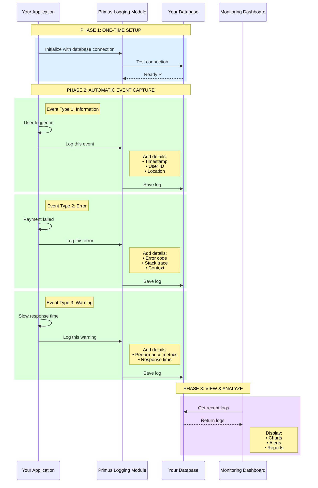

# Logging Module - How It Works

## Simple Flow Diagram



---

## What Gets Logged

✓ **User Actions** - Login, logout, data access  
✓ **Errors & Warnings** - Failures, exceptions, issues  
✓ **Performance Data** - Response times, resource usage  
✓ **Security Events** - Authentication attempts, access violations  

---

## Where It's Stored

✓ **Your Database Only** - PostgreSQL, SQL Server, MySQL  
✓ **Your Infrastructure** - Your servers, your cloud  
✓ **Your Control** - You manage retention, backups, access  
✗ **NOT on Primus Servers** - We never store your logs  

---

## Benefits

| Benefit | Description |
|---------|-------------|
| **Automatic Logging** | No manual code for each log entry |
| **Rich Context** | Automatically adds timestamp, user, location, etc. |
| **Real-Time Monitoring** | View logs as they happen |
| **Complete Ownership** | Your data stays in your infrastructure |
| **Easy Integration** | 3 lines of code to set up |
| **Flexible Filtering** | Search by user, time, severity, etc. |

---

## Simple Explanation

### How It Works in 3 Steps:

**Step 1: Setup (One Time)**
```
Your App → Primus Module: "Here's my database connection"
Primus Module → Your Database: "Testing connection..."
Your Database → Primus Module: "Ready!"
```

**Step 2: Logging (Automatic)**
```
Your App: Something happens (user login, error, etc.)
Your App → Primus Module: "Log this event"
Primus Module: Adds helpful details automatically
Primus Module → Your Database: "Save this log"
```

**Step 3: Monitoring (Anytime)**
```
Dashboard → Your Database: "Show me recent logs"
Your Database → Dashboard: "Here are the logs"
Dashboard: Shows charts, alerts, and reports
```

---

## Real-World Example

### Scenario: E-Commerce Application

**Event 1: Customer Login**
```
Time: 10:30:15 AM
Event: User logged in
User: customer@email.com
Location: New York, USA
IP: 192.168.1.100
Status: Success
```

**Event 2: Payment Error**
```
Time: 10:35:42 AM
Event: Payment processing failed
User: customer@email.com
Error: Card declined
Error Code: CARD_DECLINED_001
Amount: $99.99
Status: Error
```

**Event 3: Performance Warning**
```
Time: 10:40:18 AM
Event: Slow database query
Query: GetProductCatalog
Response Time: 3.5 seconds
Threshold: 1 second
Status: Warning
```

All these logs are automatically enriched and stored in **your database** for monitoring and analysis.

---

## Data Sovereignty

### Key Point: Your Data Stays With You

```
┌─────────────────────────────────────────┐
│  YOUR INFRASTRUCTURE                    │
│                                         │
│  ┌─────────────┐      ┌──────────────┐ │
│  │ Your App    │──────│ Your Database│ │
│  │ + Primus    │      │              │ │
│  │   Module    │      │ ALL LOGS     │ │
│  └─────────────┘      │ STORED HERE  │ │
│                       └──────────────┘ │
│                                         │
└─────────────────────────────────────────┘

┌─────────────────────────────────────────┐
│  PRIMUS PLATFORM                        │
│                                         │
│  • Provides the logging module (SDK)   │
│  • Does NOT store any logs             │
│  • Does NOT access your database       │
│  • Only provides the tool              │
└─────────────────────────────────────────┘
```

---

## Configuration Options

### What You Can Customize:

**Log Levels:**
- Trace (most detailed)
- Debug
- Information
- Warning
- Error
- Critical (most severe)

**Storage Settings:**
- Database type (PostgreSQL, SQL Server, MySQL)
- Connection string
- Table name
- Retention period (30/60/90 days)

**Batching:**
- Time-based (every 5 seconds)
- Count-based (every 100 logs)
- Immediate (for critical errors)

**Filtering:**
- By tenant/organization
- By application
- By user
- By severity level
- By date range

**Enrichment (Automatic):**
- Timestamp
- Tenant ID
- Application ID
- User ID
- IP Address
- Request ID
- Performance metrics
- Stack traces (for errors)

---

## Summary for Management

### The Elevator Pitch:

> "Primus Logging Module is like having a professional note-taker for your application. Every time something important happens - a user logs in, an error occurs, or performance slows down - the module automatically captures it with all the relevant details and stores it in **your database**. You can then view everything in a dashboard with charts and alerts. The key difference: **all your log data stays in your infrastructure**, giving you complete control and compliance with data regulations."

### Key Selling Points:

1. ✅ **5-Minute Setup** - Install package, add 3 lines of code
2. ✅ **Automatic Enrichment** - Context added automatically
3. ✅ **Your Data, Your Control** - Stored in your database only
4. ✅ **Real-Time Monitoring** - See what's happening now
5. ✅ **Compliance Ready** - GDPR, HIPAA, SOC 2 compliant
6. ✅ **Developer Friendly** - Simple API, comprehensive docs

---

## Comparison: Before vs. After

### Before Primus Logging:

```csharp
// Manual logging - lots of code
var logEntry = new LogEntry {
    Timestamp = DateTime.UtcNow,
    Message = "User logged in",
    UserId = GetCurrentUserId(),
    TenantId = GetCurrentTenantId(),
    IpAddress = GetClientIpAddress(),
    RequestId = GetRequestId(),
    // ... many more fields
};
await logRepository.SaveAsync(logEntry);
```

**Problems:**
- ❌ Repetitive code everywhere
- ❌ Easy to forget important details
- ❌ Inconsistent format
- ❌ Time-consuming to implement

### After Primus Logging:

```csharp
// Automatic logging - one line
logger.LogInformation("User logged in");
```

**Benefits:**
- ✅ One line of code
- ✅ All details added automatically
- ✅ Consistent format
- ✅ Saves development time

---

## Questions & Answers

### Q: Where are the logs stored?
**A:** In your own database (PostgreSQL, SQL Server, MySQL, etc.). Primus never stores your logs.

### Q: Can Primus access our logs?
**A:** No. The Primus module runs in your application and writes to your database. We have no access to your infrastructure.

### Q: What if we want to change databases?
**A:** Simply update the connection string in your configuration. The module works with any standard database.

### Q: How long are logs retained?
**A:** You decide. Set your own retention policy (30, 60, 90 days, or forever).

### Q: Can we export logs?
**A:** Yes. Since logs are in your database, you can export them anytime using standard database tools.

### Q: Is this compliant with GDPR/HIPAA?
**A:** Yes. Since all data stays in your infrastructure, you maintain full compliance control.

---

**Primus SaaS Platform** - *Enterprise Solutions, Developer Friendly*
