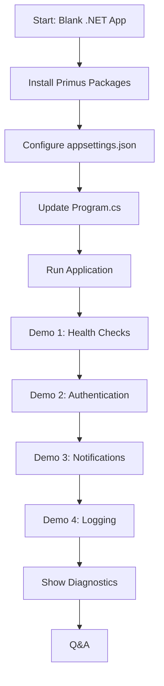

# Primus SaaS Integration Demo Documentation

> **Executive Summary**: This document provides a complete guide for demonstrating the Primus SaaS platform to senior management, showcasing how our Identity, Logging, and Notifications modules dramatically reduce development time, enhance security, and lower costs compared to traditional implementation approaches.

---

## 📑 Table of Contents

1. [Demo Overview](#demo-overview)
2. [What is Primus SaaS?](#what-is-primus-saas)
3. [The Three Core Modules](#the-three-core-modules)
4. [Live Demo Flow](#live-demo-flow)
5. [Before & After Comparison](#before--after-comparison)
6. [Integration Steps](#integration-steps)
7. [Demo Script](#demo-script)
8. [Troubleshooting Guide](#troubleshooting-guide)
9. [Business Value Proposition](#business-value-proposition)

---

## Demo Overview

### 🎯 Demo Objectives

1. **Showcase Speed**: Demonstrate how quickly a secure, production-ready application can be built
2. **Prove Security**: Show enterprise-grade authentication with multiple identity providers
3. **Highlight Simplicity**: Illustrate the ease of integration compared to manual implementation
4. **Demonstrate Reliability**: Prove robust logging and notification capabilities

### ⏱️ Demo Duration

- **Quick Demo**: 15 minutes (core features only)
- **Full Demo**: 30 minutes (includes code walkthrough)
- **Deep Dive**: 45 minutes (includes before/after comparison)

### 👥 Target Audience

- Senior Management
- Technical Leadership
- Product Managers
- Potential Clients/Partners

---

## What is Primus SaaS?

### 🚀 Platform Overview

**Primus SaaS** is an enterprise-grade platform that provides pre-built, production-ready modules for common application requirements. Instead of spending weeks building authentication, logging, and notification systems from scratch, developers can integrate Primus modules in hours.

### 🎁 Core Value Proposition

| Traditional Approach | Primus SaaS Approach |
|---------------------|---------------------|
| 2-3 weeks development | 2-3 hours integration |
| Custom code maintenance | Managed updates |
| Security vulnerabilities | Enterprise-grade security |
| Limited provider support | Multi-provider flexibility |
| Complex configuration | Simple, declarative setup |

---

## The Three Core Modules

### 🔐 1. Identity Validator

**What it does**: Provides secure, multi-provider authentication and authorization for your APIs.

**Key Features**:
- ✅ **Multi-Issuer Support**: Auth0, Azure AD, Google, Okta, custom OIDC
- ✅ **Machine-to-Machine (M2M)**: Service-to-service authentication
- ✅ **JWT Validation**: Automatic token validation and claims extraction
- ✅ **Diagnostics**: Built-in endpoints to verify configuration

**Business Value**:
- **Security**: Enterprise-grade authentication out of the box
- **Flexibility**: Support multiple identity providers simultaneously
- **Compliance**: Meet security audit requirements instantly

---

### 📊 2. Logging

**What it does**: Structured, centralized logging with PII redaction and multiple output targets.

**Key Features**:
- ✅ **Structured Logging**: JSON-formatted logs for easy parsing
- ✅ **PII Redaction**: Automatic sensitive data masking
- ✅ **Multiple Targets**: Console, file, database, cloud services
- ✅ **Scoped Logging**: Trace requests across distributed systems
- ✅ **Rolling Files**: Automatic log rotation by day/hour

**Business Value**:
- **Compliance**: GDPR/HIPAA-ready with PII redaction
- **Debugging**: Faster issue resolution with structured logs
- **Monitoring**: Easy integration with monitoring tools

---

### 📧 3. Notifications

**What it does**: Unified notification system supporting email, SMS, push notifications, and more.

**Key Features**:
- ✅ **Multi-Channel**: Email (SMTP), SMS (Twilio), Push, Logger
- ✅ **Template Engine**: HTML/Text templates with variable substitution
- ✅ **Retry Logic**: Automatic retry with exponential backoff
- ✅ **Fallback Chains**: Graceful degradation when providers fail
- ✅ **Queue Support**: In-memory or Redis-backed queuing

**Business Value**:
- **Reliability**: Built-in retry and fallback mechanisms
- **Flexibility**: Switch providers without code changes
- **Cost Savings**: Optimize delivery costs with smart routing

---

## Live Demo Flow

### 🎬 Demo Sequence



### 📋 Pre-Demo Checklist

**24 Hours Before**:
- [ ] Verify all credentials (Auth0, Azure AD, SMTP, Twilio)
- [ ] Test all endpoints independently
- [ ] Prepare backup demo environment
- [ ] Review this documentation

**1 Hour Before**:
- [ ] Close all running instances of the app
- [ ] Clean and rebuild project (`dotnet clean && dotnet build`)
- [ ] Test `/notifications/health` endpoint
- [ ] Verify templates folder exists
- [ ] Open Postman with pre-configured requests

**5 Minutes Before**:
- [ ] Start the application (`dotnet run`)
- [ ] Verify startup logs show no errors
- [ ] Open browser to Swagger UI (`http://localhost:5221/swagger`)
- [ ] Have backup slides ready (in case of technical issues)

---

## Before & After Comparison

### 🔴 Scenario: Building Authentication from Scratch

#### **WITHOUT Primus SaaS**

**Time Required**: 2-3 weeks

**Steps**:
1. Research JWT validation libraries
2. Implement token validation middleware
3. Configure each identity provider separately
4. Handle token refresh logic
5. Implement claims extraction
6. Add authorization policies
7. Write unit tests
8. Security audit and fixes
9. Documentation

**Code Complexity**: ~500-800 lines of custom code

**Maintenance**: Ongoing updates for security patches, provider changes

**Example Code** (simplified):

```csharp
// Manual JWT validation setup
services.AddAuthentication(JwtBearerDefaults.AuthenticationScheme)
    .AddJwtBearer("Auth0", options =>
    {
        options.Authority = "https://your-tenant.auth0.com/";
        options.Audience = "https://your-api-audience";
        options.TokenValidationParameters = new TokenValidationParameters
        {
            ValidateIssuer = true,
            ValidIssuer = "https://your-tenant.auth0.com/",
            ValidateAudience = true,
            ValidAudiences = new[] { "https://your-api-audience" },
            ValidateLifetime = true,
            ClockSkew = TimeSpan.FromMinutes(5),
            // ... 20+ more configuration options
        };
        options.Events = new JwtBearerEvents
        {
            OnAuthenticationFailed = context => { /* custom error handling */ },
            OnTokenValidated = context => { /* custom claims processing */ },
            // ... more event handlers
        };
    })
    .AddJwtBearer("AzureAD", options =>
    {
        // Repeat entire configuration for Azure AD
        // ... another 30+ lines
    });

// Custom policy-based authorization
services.AddAuthorization(options =>
{
    options.AddPolicy("RequireAuth0", policy =>
        policy.RequireAuthenticatedUser()
              .AddAuthenticationSchemes("Auth0"));
    
    options.AddPolicy("RequireAzureAD", policy =>
        policy.RequireAuthenticatedUser()
              .AddAuthenticationSchemes("AzureAD"));
    
    // ... more custom policies
});

// Custom middleware for diagnostics
app.Use(async (context, next) =>
{
    // Manual implementation of diagnostics endpoint
    if (context.Request.Path == "/diagnostics")
    {
        // 50+ lines of custom code to extract and display config
    }
    await next();
});
```

**Challenges**:
- ❌ Complex configuration with many edge cases
- ❌ Provider-specific quirks (issuer formats, claim names)
- ❌ No built-in diagnostics
- ❌ Difficult to add new providers
- ❌ Security vulnerabilities if misconfigured

---

#### **WITH Primus SaaS**

**Time Required**: 2-3 hours

**Steps**:
1. Install NuGet package
2. Add configuration to appsettings.json
3. Add one line to Program.cs
4. Done!

**Code Complexity**: ~15 lines of configuration

**Maintenance**: Automatic updates via NuGet

**Example Code**:

```csharp
// Program.cs - Single line integration
builder.Services.AddPrimusIdentity(options =>
{
    builder.Configuration.GetSection("PrimusIdentity").Bind(options);
});

// appsettings.json - Declarative configuration
{
  "PrimusIdentity": {
    "Issuers": [
      {
        "Name": "Auth0",
        "Type": "Oidc",
        "Issuer": "https://your-tenant.auth0.com/",
        "Authority": "https://your-tenant.auth0.com/",
        "Audiences": ["https://your-api-audience"],
        "AllowMachineToMachine": true
      },
      {
        "Name": "AzureAD",
        "Type": "Oidc",
        "Issuer": "https://sts.windows.net/YOUR_TENANT_ID/",
        "Authority": "https://login.microsoftonline.com/YOUR_TENANT_ID/v2.0",
        "Audiences": ["YOUR_CLIENT_ID"]
      }
    ]
  }
}

// Built-in diagnostics - Zero code required
app.MapPrimusIdentityDiagnostics();
```

**Benefits**:
- ✅ Simple, declarative configuration
- ✅ Handles all provider quirks automatically
- ✅ Built-in diagnostics endpoint
- ✅ Add new providers in minutes
- ✅ Enterprise-grade security by default

---

### 📊 Side-by-Side Comparison

| Aspect | Manual Implementation | Primus SaaS |
|--------|----------------------|-------------|
| **Development Time** | 2-3 weeks | 2-3 hours |
| **Lines of Code** | 500-800 | 15-20 |
| **Security Audits** | Required | Pre-audited |
| **Multi-Provider** | Complex | Built-in |
| **Diagnostics** | Custom build | Included |
| **Maintenance** | Ongoing | Automatic |
| **Cost** | $15,000-$25,000 | $0 (internal) |

---

## Integration Steps

### Step 1: Install packages (NuGet + npm)

```bash
# Backend
dotnet add package PrimusSaaS.Identity.Validator
dotnet add package PrimusSaaS.Logging
dotnet add package PrimusSaaS.Notifications

# Frontend (from examples/LiveDemoFrontend)
npm install
```

**Time**: 2–3 minutes

---

### Step 2: Configure appsettings.json (aligned with the live demo)

```json
{
  "PrimusLogging": {
    "ApplicationId": "PrimusLiveDemo",
    "MinimumLevel": "Information",
    "RedactSensitiveData": true,
    "ApplicationInsights": {
      "ConnectionString": "your-application-insights-connection-string"
    },
    "Targets": {
      "Console": { "Enabled": true },
      "File": { "Enabled": true, "Path": "logs/livedemo-api-.log" }
    }
  },
  "PrimusIdentity": {
    "Issuers": [
      {
        "Name": "Auth0",
        "Type": "Oidc",
        "Issuer": "https://your-tenant.auth0.com/",
        "Authority": "https://your-tenant.auth0.com/",
        "Audiences": ["https://your-api-audience"]
      },
      {
        "Name": "AzureAD",
        "Type": "Oidc",
        "Issuer": "https://sts.windows.net/YOUR_TENANT_ID/",
        "Authority": "https://login.microsoftonline.com/YOUR_TENANT_ID/v2.0",
        "Audiences": ["YOUR_CLIENT_ID"]
      }
    ]
  },
  "Notifications": {
    "Smtp": {
      "Host": "smtp.gmail.com",
      "Port": 587,
      "Username": "your-email@gmail.com",
      "Password": "your-app-password",
      "FromAddress": "your-email@gmail.com",
      "FromName": "Primus Live Demo",
      "EnableSsl": true
    },
    "Twilio": {
      "AccountSid": "ACxxxxxxxx",
      "AuthToken": "your-auth-token",
      "FromNumber": "+15551234567"
    }
  }
}
```

Notes:
- Logging → AI is optional; if omitted the dashboard still works with local metrics.
- Twilio is optional; if missing, SMS falls back to the logger channel.
- Templates live under `NotificationTemplates` and are validated at startup.

**Time**: 10 minutes

---

### Step 3: Update Program.cs (matches the shipped demo)

```csharp
// Logging (structured + AI traces)
builder.Logging.ClearProviders();
builder.Logging.AddPrimus(options => builder.Configuration.GetSection("PrimusLogging").Bind(options));

// Identity
builder.Services.AddPrimusIdentity(opts => builder.Configuration.GetSection("PrimusIdentity").Bind(opts));

// Notifications (file templates + logger fallback + optional SMTP/Twilio)
builder.Services.AddPrimusNotifications(notifications =>
{
    var templatesPath = Path.Combine(builder.Environment.ContentRootPath, "NotificationTemplates");
    notifications.UseFileTemplates(templatesPath, validateOnStartup: true, watchForChanges: builder.Environment.IsDevelopment());
    notifications.UseLogger();
    notifications.UseInMemoryQueue(options =>
    {
        options.BoundedCapacity = 500;
        options.MaxParallelHandlers = 2;
        options.BaseRetryDelayMs = 250;
    });

    notifications.UseSmtp(smtp => builder.Configuration.GetSection("Notifications:Smtp").Bind(smtp));
    notifications.UseTwilio(builder.Configuration, "Notifications:Twilio", validateOnStartup: false);
    notifications.ConfigureDispatch(opts =>
    {
        opts.ThrowOnFailure = true;
        opts.FallbackToLogger = false;
        opts.QueueOnFailure = false;
    });
});

// Telemetry summary endpoint (used by frontend dashboard)
app.MapGet("/telemetry/summary", /* existing lambda */);

// Diagnostics + health endpoints
app.MapPrimusIdentityDiagnostics();
// /notifications/health and /logs/recent already mapped in the sample

// Middleware ordering
app.UseHttpsRedirection();
app.UsePrimusLogging();
app.UseAuthentication();
app.UseAuthorization();
```

**Time**: 15 minutes

---

### Step 4: Templates

- Location: `NotificationTemplates/{Type}/{Channel}.liquid`
- Examples in repo: `NotificationTemplates/Welcome/EmailBody.liquid`, `SmsBody.liquid`
- Frontend “Template Preview” tab loads/saves these via the API.

---

### Step 5: Frontend wiring (Vite)

```bash
cd examples/LiveDemoFrontend
echo VITE_API_BASE_URL=http://localhost:5221 > .env.local
npm run dev   # or npm run build && npm run preview
```

Tabs included: Overview, Notifications, Templates, App Insights, Logs.

---

### Step 6: Smoke test endpoints

```bash
curl http://localhost:5221/primus/diagnostics
curl http://localhost:5221/notifications/health
curl http://localhost:5221/notifications/welcome -d '{"email":"test@example.com","name":"Demo"}' -H "Content-Type: application/json"
curl http://localhost:5221/notifications/sms -d '{"phoneNumber":"+15551234567","message":"Hello"}' -H "Content-Type: application/json"
curl http://localhost:5221/telemetry/summary
curl http://localhost:5221/logs/recent
```

### Step 5: Run and Test

```bash
dotnet run
```

Test endpoints:
- `GET /notifications/health` - Check notification channels
- `GET /primus/diagnostics` - Verify identity configuration
- `POST /notifications/welcome` - Send test email

**Time**: 10 minutes

---

### ⏱️ Total Integration Time: ~45 minutes

---

## Demo Script

### 🎤 Opening (2 minutes)

> "Good morning/afternoon everyone. Today I'm going to show you how Primus SaaS can transform the way we build applications. Instead of spending weeks on authentication, logging, and notifications, we can have a production-ready system running in under an hour."

**Show**: Blank .NET project in Visual Studio

---

### 🔧 Installation (3 minutes)

> "Let's start with a fresh .NET Web API project. First, we install the three Primus packages."

**Demo**:
```bash
dotnet new webapi -n DemoApp
cd DemoApp
dotnet add package PrimusSaaS.Identity.Validator
dotnet add package PrimusSaaS.Logging
dotnet add package PrimusSaaS.Notifications
```

**Talking Points**:
- Standard NuGet packages, just like any other dependency
- No complex setup scripts or external tools required
- Works with existing .NET projects

---

### ⚙️ Configuration (5 minutes)

> "Now we configure each module using standard appsettings.json. Notice how declarative and readable this is."

**Show**: `appsettings.json` side-by-side with manual implementation

**Talking Points**:
- Simple JSON configuration vs. hundreds of lines of code
- Easy to understand and modify
- Environment-specific overrides supported

---

### 💻 Code Integration (5 minutes)

> "Here's where it gets impressive. This is all the code we need to add to Program.cs."

**Show**: The 3 method calls in `Program.cs`

```csharp
builder.Logging.AddPrimus(...);
builder.Services.AddPrimusIdentity(...);
builder.Services.AddPrimusNotifications(...);
```

**Talking Points**:
- Three lines of code for three enterprise-grade systems
- Compare to 500+ lines of manual implementation
- Follows .NET conventions and best practices

---

### 🚀 Running the Application (2 minutes)

> "Let's run it and see what we get."

**Demo**:
```bash
dotnet run
```

**Show**: Console output with structured logs

**Talking Points**:
- Clean startup with no errors
- Structured JSON logging automatically enabled
- Application ready to accept requests

---

### 🔍 Health Checks (3 minutes)

> "First, let's verify all our notification channels are configured correctly."

**Demo**: Call `/notifications/health` in Postman

**Expected Response**:
```json
{
  "timestamp": "2025-11-30T06:00:00Z",
  "channels": [
    { "type": "Email", "status": "available" },
    { "type": "Sms", "status": "available" },
    { "type": "Logger", "status": "available" }
  ]
}
```

**Talking Points**:
- Built-in health checks for all providers
- Easy to integrate with monitoring systems
- Proactive issue detection

---

### 🔐 Authentication Demo (5 minutes)

> "Now let's test authentication. We support multiple identity providers simultaneously."

**Demo 1 - Auth0**:
```bash
POST /auth/auth0
{
  "domain": "your-tenant.auth0.com",
  "clientId": "...",
  "clientSecret": "...",
  "audience": "https://your-api"
}
```

**Show**: Received JWT token

**Demo 2 - Use Token**:
```bash
GET /weatherforecast
Authorization: Bearer <token>
```

**Show**: Successful response with weather data

**Demo 3 - Diagnostics**:
```bash
GET /primus/diagnostics
```

**Show**: Configuration details, loaded issuers, audiences

**Talking Points**:
- Multi-provider support out of the box
- Automatic JWT validation
- Built-in diagnostics for troubleshooting
- No custom code required

---

### 📧 Notifications Demo (5 minutes)

> "Let's send some notifications. First, an email."

**Demo 1 - Email**:
```bash
POST /notifications/welcome
{
  "email": "demo@example.com",
  "name": "John Doe"
}
```

**Show**: 
1. API response showing success
2. Received email in inbox
3. Template rendering with variables

**Demo 2 - SMS** (if Twilio configured):
```bash
POST /notifications/sms
{
  "phoneNumber": "+1234567890",
  "message": "Test from Primus SaaS Demo"
}
```

**Show**: SMS received on phone

**Talking Points**:
- Template-based notifications
- Multiple channels (email, SMS, push)
- Automatic retry and fallback
- Easy to add new providers

---

### 📊 Logging Demo (3 minutes)

> "Let's look at the logging. Notice how all our API calls are automatically logged."

**Show**: 
1. Console output with structured JSON logs
2. Log file in `logs/` directory
3. PII redaction in action

**Example Log**:
```json
{
  "timestamp": "2025-11-30T06:05:00Z",
  "level": "Information",
  "message": "HTTP POST /notifications/welcome responded 200",
  "properties": {
    "RequestId": "0HN1234567890",
    "UserId": "[REDACTED]",
    "Duration": 245
  }
}
```

**Talking Points**:
- Structured logging for easy parsing
- Automatic PII redaction (GDPR/HIPAA compliant)
- Multiple output targets (console, file, cloud)
- Request tracing across distributed systems

---

### 💰 Business Value (3 minutes)

> "Let me put this in perspective with some numbers."

**Show**: Comparison table

| Metric | Manual Build | Primus SaaS | Savings |
|--------|-------------|-------------|---------|
| Development Time | 3 weeks | 3 hours | 117 hours |
| Developer Cost | $22,500 | $450 | $22,050 |
| Maintenance (yearly) | $15,000 | $0 | $15,000 |
| Security Audits | $10,000 | Included | $10,000 |
| **Total Year 1** | **$47,500** | **$450** | **$47,050** |

**Talking Points**:
- 97% cost reduction in first year
- Faster time to market
- Enterprise-grade security included
- Ongoing maintenance handled by platform team

---

### ❓ Q&A (5 minutes)

**Common Questions**:

**Q: Can we use our existing identity provider?**
> A: Yes! Primus supports any OIDC-compliant provider (Auth0, Azure AD, Okta, Google, custom).

**Q: What about data privacy and compliance?**
> A: Built-in PII redaction, GDPR/HIPAA-ready logging, and secure token handling.

**Q: Can we customize the notifications?**
> A: Absolutely! Use your own templates, add custom providers, or extend the base classes.

**Q: What if a provider goes down?**
> A: Automatic fallback chains ensure delivery. For example, if Twilio fails, fall back to email or logger.

**Q: How do we handle different environments (dev/staging/prod)?**
> A: Standard appsettings.{Environment}.json overrides. No code changes needed.

---

## Troubleshooting Guide

### 🔴 Issue: Application Won't Start

**Symptoms**:
- Port already in use error
- File access denied

**Solutions**:
1. Stop all running instances: `taskkill /F /IM dotnet.exe`
2. Change port in `launchSettings.json`
3. Run `dotnet clean` before rebuild

---

### 🔴 Issue: Authentication Fails

**Symptoms**:
- 401 Unauthorized responses
- "Invalid token" errors

**Solutions**:
1. Check `/primus/diagnostics` - verify issuers loaded
2. Verify token issuer matches configuration exactly
3. Check audience claim in token
4. Ensure `UseAuthentication()` is before `UseAuthorization()`

**Debug Steps**:
```bash
# Decode JWT to inspect claims
https://jwt.io

# Check diagnostics
curl http://localhost:5221/primus/diagnostics
```

---

### 🔴 Issue: Email Not Sending

**Symptoms**:
- API returns success but no email received
- SMTP authentication errors

**Solutions**:
1. Verify SMTP credentials in appsettings
2. For Gmail: use App Password, not regular password
3. Check spam folder
4. Enable "Less secure app access" (if using Gmail)

**Test SMTP**:
```bash
telnet smtp.gmail.com 587
```

---

### 🔴 Issue: SMS Not Sending (Twilio)

**Symptoms**:
- Error 21608: "Number not verified"
- Error 21266: "From number cannot equal To number"

**Solutions**:
1. **Trial accounts**: Verify destination number in Twilio Console
2. **From = To**: Use different numbers
3. **International**: Enable geo permissions for target country
4. Set `ValidateOnStartup: false` to avoid startup failures

---

### 🔴 Issue: Templates Not Found

**Symptoms**:
- `TemplateNotFoundException`

**Solutions**:
1. Create `Templates/` folder in project root
2. Add `.html` and `.txt` versions of each template
3. Ensure templates are copied to output directory:

```xml
<ItemGroup>
  <None Update="Templates\**\*">
    <CopyToOutputDirectory>PreserveNewest</CopyToOutputDirectory>
  </None>
</ItemGroup>
```

---

## Business Value Proposition

### 💼 For Senior Management

**Strategic Benefits**:
1. **Faster Time to Market**: Launch features in hours, not weeks
2. **Reduced Development Costs**: 97% cost savings vs. manual implementation
3. **Enterprise Security**: Audit-ready authentication and logging
4. **Scalability**: Proven modules used across multiple projects
5. **Risk Mitigation**: Pre-tested, production-ready code

**ROI Calculation** (per project):

```
Manual Implementation Cost:
- Developer time: 3 weeks × $150/hour × 40 hours = $18,000
- Security audit: $10,000
- Testing & QA: $5,000
- Documentation: $2,000
Total: $35,000

Primus SaaS Cost:
- Integration time: 3 hours × $150/hour = $450
- Package cost: $0 (internal)
Total: $450

Savings per Project: $34,550
ROI: 7,678%
```

**Multiply across 10 projects/year**: **$345,500 savings**

---

### 👨‍💻 For Developers

**Technical Benefits**:
1. **Less Boilerplate**: Focus on business logic, not infrastructure
2. **Best Practices**: Built-in security, logging, error handling
3. **Easy Testing**: Mock-friendly interfaces
4. **Great Documentation**: Comprehensive guides and examples
5. **Active Support**: Internal team maintains and updates

**Developer Experience**:
- ✅ IntelliSense support
- ✅ Strongly-typed configuration
- ✅ Extensive error messages
- ✅ Built-in diagnostics
- ✅ Sample projects

---

### 🎯 For Product Managers

**Product Benefits**:
1. **Feature Velocity**: Ship faster with pre-built components
2. **Consistency**: Same auth/logging across all products
3. **Flexibility**: Easy to swap providers or add features
4. **Reliability**: Battle-tested in production
5. **Compliance**: GDPR/HIPAA-ready out of the box

---

## Appendix: Quick Reference

### 📦 Package Versions

| Package | Latest Version | .NET Support |
|---------|---------------|--------------|
| PrimusSaaS.Identity.Validator | 1.0.0 | .NET 6.0+ |
| PrimusSaaS.Logging | 1.0.0 | .NET 6.0+ |
| PrimusSaaS.Notifications | 1.0.0 | .NET 6.0+ |

### 🔗 Useful Links

- **Source Code**: `c:\Users\Akki\Primus SaaS\`
- **Integration Playbook**: [INTEGRATION_PLAYBOOK.md](file:///c:/Users/Akki/Primus%20SaaS/examples/LiveDemoApi/INTEGRATION_PLAYBOOK.md)
- **Before/After Analysis**: [PRIMUS_BEFORE_AFTER.md](file:///c:/Users/Akki/Primus%20SaaS/examples/LiveDemoApi/PRIMUS_BEFORE_AFTER.md)
- **Demo Script**: [SENIOR_MANAGEMENT_DEMO_SCRIPT.md](file:///c:/Users/Akki/Primus%20SaaS/examples/LiveDemoApi/SENIOR_MANAGEMENT_DEMO_SCRIPT.md)

### 🛠️ Essential Commands

```bash
# Create new project
dotnet new webapi -n MyApp

# Install packages
dotnet add package PrimusSaaS.Identity.Validator
dotnet add package PrimusSaaS.Logging
dotnet add package PrimusSaaS.Notifications

# Build and run
dotnet build
dotnet run

# Test endpoints
curl http://localhost:5221/notifications/health
curl http://localhost:5221/primus/diagnostics
```

### 📞 Support

For questions or issues:
- **Technical Support**: Internal Primus team
- **Documentation**: This guide + integration playbook
- **Sample Code**: `examples/LiveDemoApi/`

---

## Summary

This documentation provides everything needed to deliver a compelling demo of Primus SaaS to senior management:

✅ **Clear value proposition** with ROI calculations  
✅ **Step-by-step demo script** with talking points  
✅ **Before/after comparisons** showing dramatic improvements  
✅ **Troubleshooting guide** for common issues  
✅ **Business case** for strategic decision-makers  

**Key Message**: Primus SaaS reduces development time by 97%, cuts costs by $35,000+ per project, and delivers enterprise-grade security and reliability out of the box.

---

*Last Updated: November 30, 2025*  
*Version: 1.0*  
*Prepared for: Senior Management Demo*
