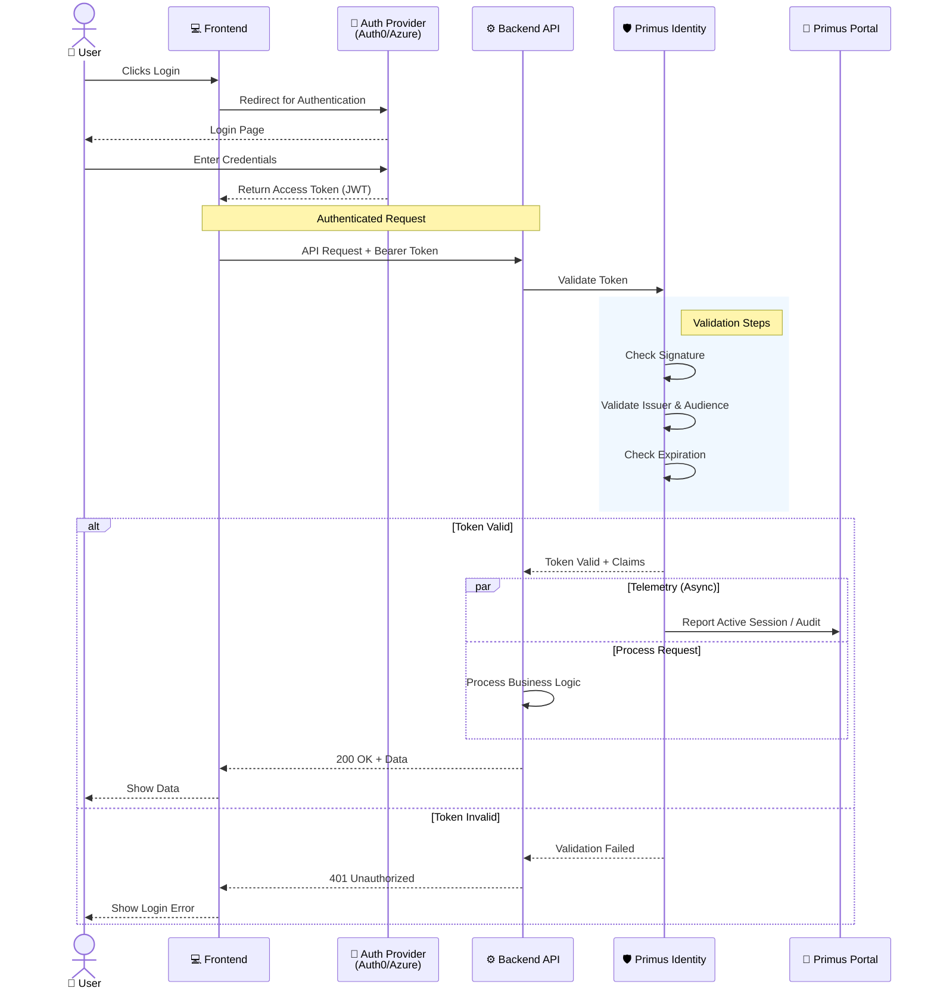
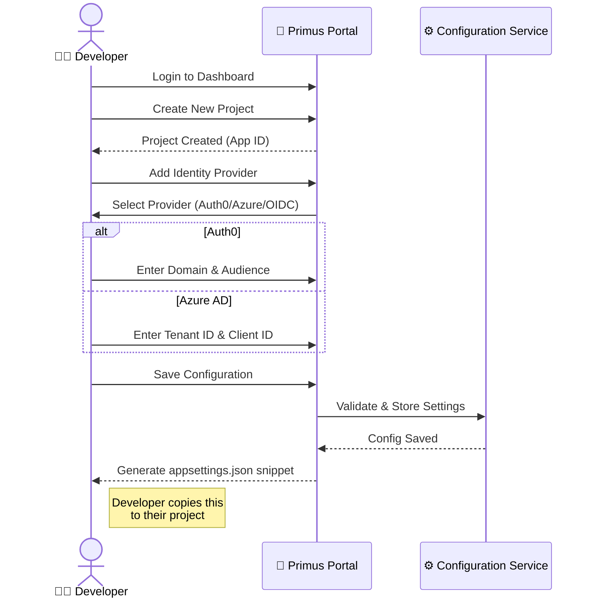
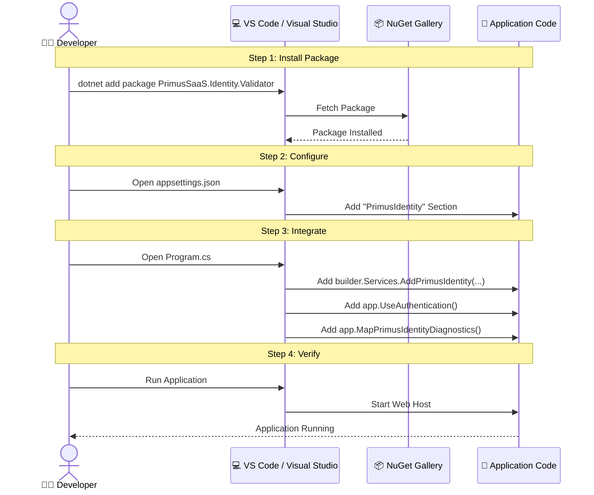
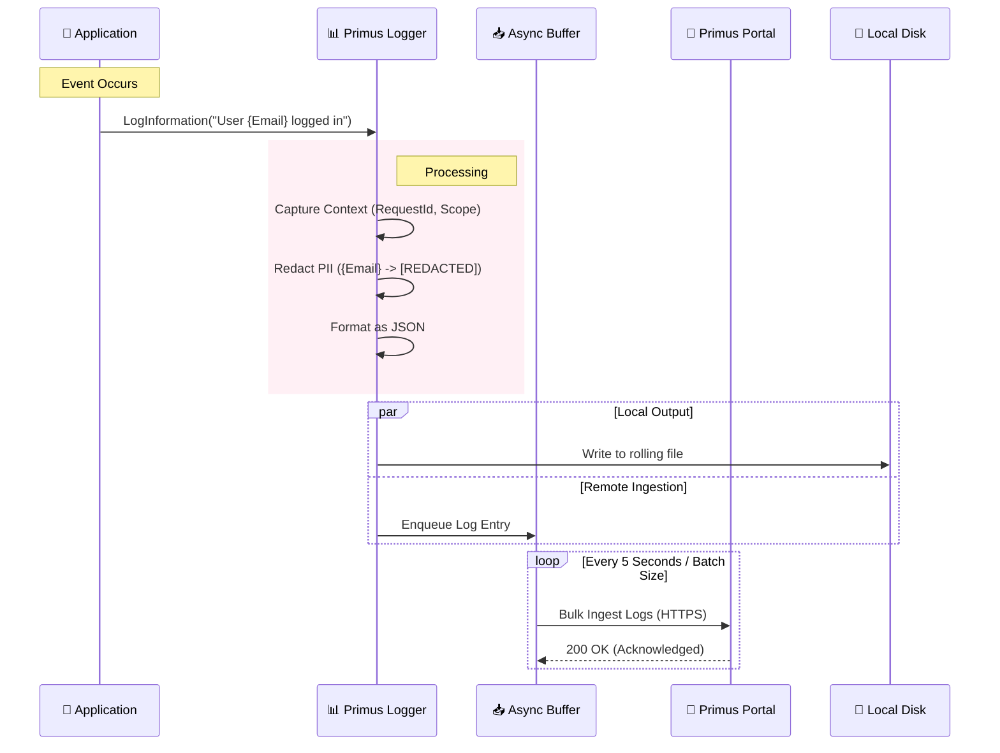
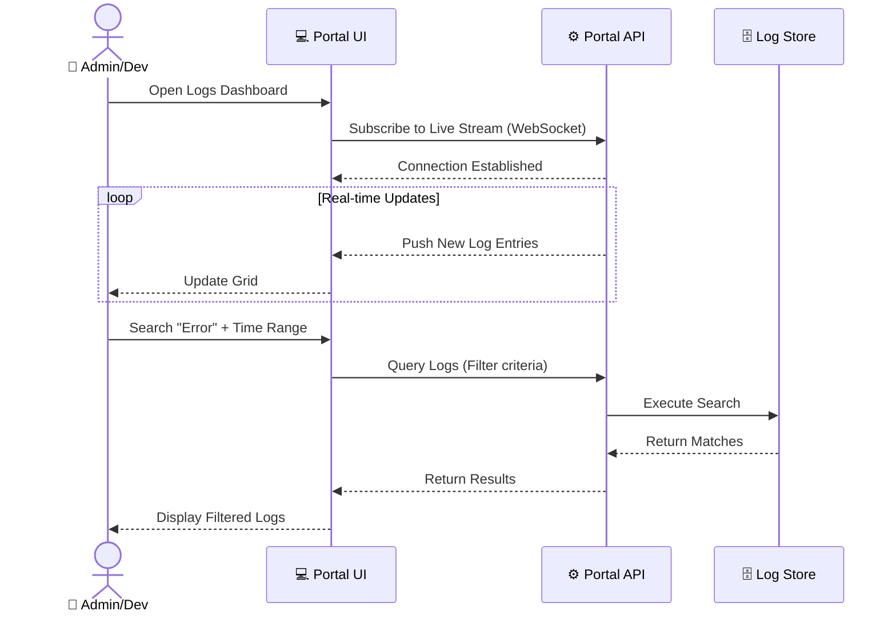
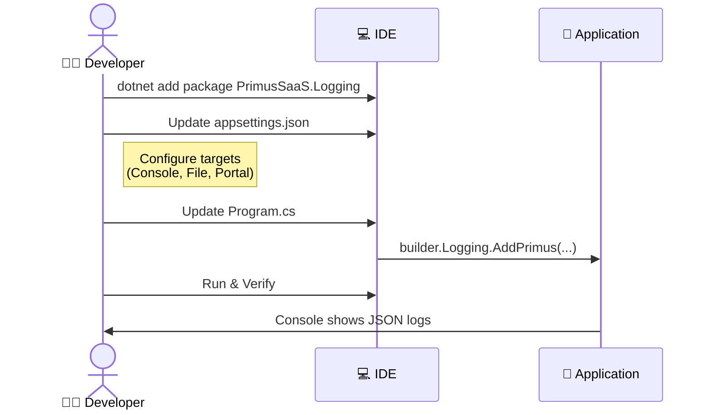
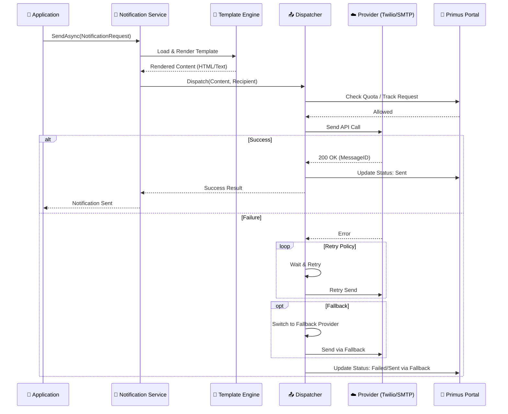
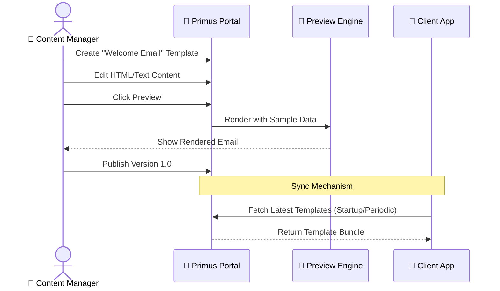
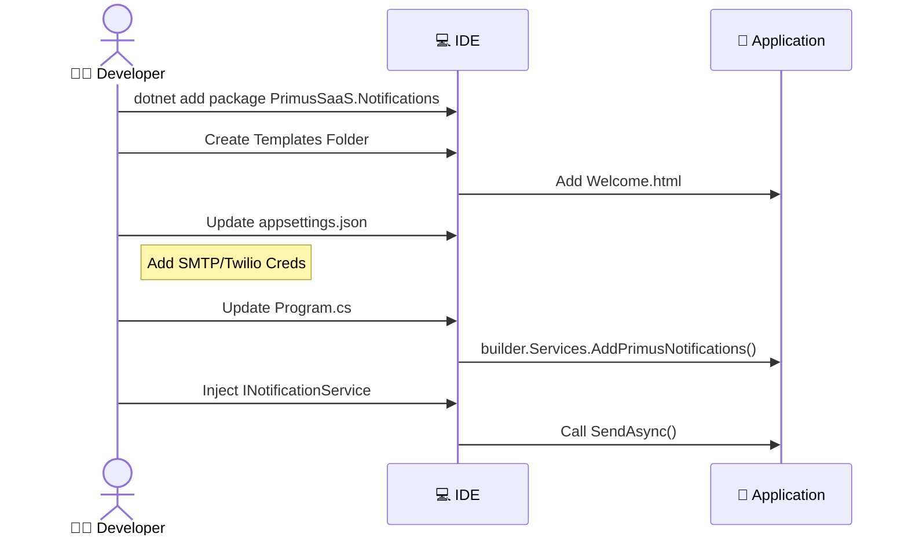

# Primus SaaS Integration Flows

> **Purpose**: Detailed sequence diagrams illustrating the integration and runtime flows for Primus SaaS modules. These diagrams cover the interactions between the Client, Frontend, Backend, Auth Provider, and Primus Portal.

---

## 🛡️ Module 1: Identity Validator

### 1. Runtime Integration Flow
This diagram shows the end-to-end authentication flow, from the user clicking "Login" to the backend validating the token and reporting to Primus Portal.

### 2. Portal Configuration Flow
How a developer configures the Identity module in the Primus Portal.

### 3. Client Installation Flow
The steps a developer takes to install and integrate the package.

---

## 📊 Module 2: Logging

### 1. Runtime Integration Flow
How logs flow from the application to the Primus Portal.

### 2. Portal View Flow
How a user interacts with logs in the Primus Portal.

### 3. Client Installation Flow

---

## 🔔 Module 3: Notifications

### 1. Runtime Integration Flow
The flow of sending a notification through Primus.

### 2. Portal Template Flow
Managing templates in the portal.

### 3. Client Installation Flow

