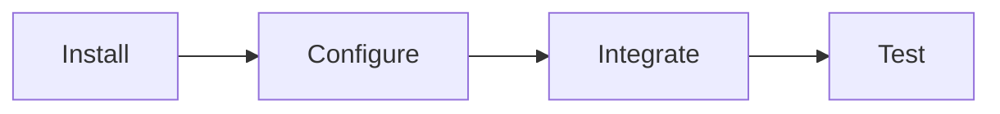

# Visual Assets Creation Guide for Primus SaaS Presentation

> **Purpose**: Instructions for creating professional visual assets for the Primus SaaS demo presentation. These can be created using tools like PowerPoint, Canva, Figma, or Adobe Illustrator.

---

## 📊 Required Visual Assets

### 1. Identity Validator Integration Journey

**Type**: Horizontal timeline infographic  
**Dimensions**: 1920x600px  
**Color Scheme**: Blue (#2196F3) and Green (#4CAF50)

**Elements**:
- **Title**: "Identity Validator Integration" (top, centered)
- **4 Steps** (left to right):
  1. 📦 Package icon → "Install Package" → "2 min"
  2. ⚙️ Settings icon → "Configure appsettings.json" → "10 min"
  3. 💻 Code icon → "Add to Program.cs" → "3 min"
  4. ✅ Shield icon → "Test & Verify" → "5 min"
- **Footer**: "Total: 20 minutes" (green badge)
- **Arrows**: Connecting each step

**Tools**: PowerPoint SmartArt, Canva Timeline Template

---

### 2. Identity Before/After Comparison

**Type**: Split-screen comparison  
**Dimensions**: 1920x1080px  
**Color Scheme**: Red (#F44336) vs Green (#4CAF50)

**Left Side (Before - Red)**:
- Title: "Manual Implementation"
- Code editor mockup with 20+ lines
- Icons: ⏰ "2-3 weeks", ⚠️ Warning, 🔧 "High Maintenance"
- Text: "500+ lines of code"

**Right Side (After - Green)**:
- Title: "Primus Identity"
- Code editor mockup with 3-4 lines
- Icons: ⏰ "20 minutes", ✅ Checkmark, 🔄 "Auto-Update"
- Text: "15 lines of code"

**Center**: Large arrow → "97% Reduction"

**Tools**: PowerPoint, Canva Split Screen Template

---

### 3. Logging Integration Journey

**Type**: Horizontal timeline infographic  
**Dimensions**: 1920x600px  
**Color Scheme**: Purple (#9C27B0) and Blue (#2196F3)

**Elements**:
- **Title**: "Logging Module Integration"
- **4 Steps**:
  1. 📦 "Install Package" → "2 min"
  2. ⚙️ "Configure Logging" → "5 min"
  3. 💻 "Replace Default Logger" → "3 min"
  4. 📄 "View Structured Logs" → "3 min"
- **Footer**: "Total: 10 minutes" (purple badge)

---

### 4. Logging Before/After Comparison

**Type**: Split-screen log output  
**Dimensions**: 1920x1080px  
**Color Scheme**: Gray/Red vs Green/Blue

**Left Side (Before)**:
- Title: "Default Logging"
- Plain text log lines:
  ```
  info: User john.doe@example.com logged in
  warn: Failed to send email to user@example.com
  ```
- Icons: ❌ No structure, ❌ PII exposed, 📺 Console only
- Label: "Plain Text, PII Exposed"

**Right Side (After)**:
- Title: "Primus Logging"
- JSON formatted logs:
  ```json
  {
    "user": "[REDACTED]",
    "action": "login",
    "timestamp": "2025-11-30T06:00:00Z"
  }
  ```
- Icons: ✅ Structured, ✅ PII redacted, 📁 Multi-output
- Label: "Structured JSON, GDPR Compliant"

**Center**: 🛡️ Shield with checkmark

---

### 5. Notifications Integration Journey

**Type**: Horizontal timeline infographic  
**Dimensions**: 1920x600px  
**Color Scheme**: Orange (#FF9800) and Red (#F44336)

**Elements**:
- **Title**: "Notifications Module Integration"
- **5 Steps**:
  1. 📦 "Install Package" → "2 min"
  2. ⚙️ "Configure Providers" → "10 min"
  3. 📄 "Create Templates" → "5 min"
  4. 💻 "Add to Program.cs" → "3 min"
  5. 🔔 "Send Test" → "5 min"
- **Footer**: "Total: 20 minutes" (orange badge)

---

### 6. Notifications Before/After Comparison

**Type**: Split-screen code comparison  
**Dimensions**: 1920x1080px  
**Color Scheme**: Red/Orange vs Green

**Left Side (Before)**:
- Title: "Manual SMTP/SMS"
- Code editor with 30+ lines
- Hardcoded HTML in C# strings
- Icons: ❌ No templates, ❌ Manual retry, 🔀 Separate code
- Text: "300+ lines, 1-2 weeks"

**Right Side (After)**:
- Title: "Primus Notifications"
- Code editor with 5-6 lines
- Separate template file icon
- Icons: ✅ Templates, ✅ Auto-retry, 🔄 Unified
- Text: "20 lines + templates, 20 minutes"

**Center**: 📧📱🔔 Multi-channel funnel

---

### 7. Primus Modules Overview Dashboard

**Type**: Three-panel dashboard  
**Dimensions**: 1920x1080px  
**Color Scheme**: Blue, Purple, Orange

**Layout** (Three horizontal sections):

**Top Panel - Identity Validator** (Blue #2196F3):
- 🛡️ Shield icon (large, left)
- "Multi-Provider Authentication"
- Features: "JWT Validation • M2M Auth • Diagnostics"
- Time badge: "20 min"

**Middle Panel - Logging** (Purple #9C27B0):
- 📊 Document icon (large, left)
- "Structured Logging"
- Features: "PII Redaction • JSON Format • Multi-Target"
- Time badge: "10 min"

**Bottom Panel - Notifications** (Orange #FF9800):
- 🔔 Bell icon (large, left)
- "Multi-Channel Notifications"
- Features: "Templates • Retry Logic • Email/SMS"
- Time badge: "20 min"

**Header**: "Primus SaaS Platform"  
**Footer**: "Complete Integration: 60 minutes" (large green badge)

---

### 8. ROI Comparison Chart

**Type**: Bar chart  
**Dimensions**: 1920x1080px  
**Color Scheme**: Red (#F44336) vs Green (#4CAF50)

**Chart Elements**:

**Left Bar (Manual - Red)**:
- Height: $35,000
- Stacked segments:
  - Developer time: $18,000 (bottom)
  - Security audit: $10,000
  - Testing: $5,000
  - Documentation: $2,000 (top)
- Label: "Manual Implementation"
- Sublabel: "2-3 weeks"

**Right Bar (Primus - Green)**:
- Height: $450
- Single segment
- Label: "Primus SaaS"
- Sublabel: "3 hours"

**Callout** (center, large):
- "97% Cost Reduction"
- "$34,550 Saved Per Project"

**Footer**:
- "10 Projects/Year = $345,500 Annual Savings"

**Chart Features**:
- Y-axis with dollar amounts
- Grid lines for readability
- Legend explaining colors

---

### 9. Complete Integration Flow

**Type**: Vertical flowchart  
**Dimensions**: 1080x1920px (portrait)  
**Color Scheme**: Multi-color (step-specific)

**Flow** (top to bottom):

1. **START** (Green circle): "New .NET Project"
2. **Step 1** (Blue box): "Install 3 Packages" • 5 min
3. **Step 2** (Purple box): "Configure appsettings.json" • 20 min
4. **Step 3** (Split into 3 parallel paths):
   - Path A (Blue): "Identity Setup" • 3 min
   - Path B (Purple): "Logging Setup" • 3 min
   - Path C (Orange): "Notifications Setup" • 5 min
5. **Step 4** (Yellow box): "Create Templates" • 5 min
6. **Step 5** (Teal box): "Add Middleware" • 2 min
7. **Step 6** (Green box): "Test All Components" • 15 min
8. **END** (Green circle): "Production Ready!" ✅

**Side Panel** (right):
- Timeline ruler showing cumulative time

**Footer**: "Total Time: ~60 minutes"

---

## 🎨 Design Guidelines

### Color Palette

```
Primary Colors:
- Identity Blue: #2196F3
- Logging Purple: #9C27B0
- Notifications Orange: #FF9800
- Success Green: #4CAF50
- Error Red: #F44336

Neutral Colors:
- Background: #FFFFFF
- Text Dark: #212121
- Text Light: #757575
- Border: #E0E0E0
```

### Typography

- **Headers**: Roboto Bold, 36-48pt
- **Subheaders**: Roboto Medium, 24-32pt
- **Body Text**: Roboto Regular, 16-20pt
- **Labels**: Roboto Medium, 14-18pt

### Icons

Use consistent icon style:
- **Recommended**: Material Design Icons, Font Awesome
- **Style**: Outlined or filled (consistent throughout)
- **Size**: 48x48px for main icons, 32x32px for secondary

### Spacing

- **Padding**: 20-40px around elements
- **Margins**: 16-24px between sections
- **Line Height**: 1.5x for readability

---

## 🛠️ Recommended Tools

### For Quick Creation
1. **Canva** (easiest, templates available)
   - Search for "Timeline", "Comparison", "Dashboard"
   - Drag-and-drop interface
   - Export as PNG/PDF

2. **PowerPoint**
   - Use SmartArt for timelines
   - Shapes for boxes and arrows
   - Export as high-res images

### For Professional Quality
1. **Figma** (free, collaborative)
   - Vector-based
   - Component libraries
   - Easy sharing

2. **Adobe Illustrator** (professional)
   - Vector graphics
   - Precise control
   - Print-ready output

---

## 📋 Asset Checklist

Use this checklist when creating assets:

- [ ] **Identity Integration Journey** - Timeline with 4 steps
- [ ] **Identity Before/After** - Split screen comparison
- [ ] **Logging Integration Journey** - Timeline with 4 steps
- [ ] **Logging Before/After** - Log output comparison
- [ ] **Notifications Integration Journey** - Timeline with 5 steps
- [ ] **Notifications Before/After** - Code comparison
- [ ] **Primus Modules Overview** - Three-panel dashboard
- [ ] **ROI Comparison Chart** - Bar chart with savings
- [ ] **Complete Integration Flow** - Vertical flowchart

**Total**: 9 visual assets

---

## 💡 Quick Tips

1. **Consistency**: Use the same icon style throughout
2. **Contrast**: Ensure text is readable on backgrounds
3. **Simplicity**: Don't overcrowd - white space is good
4. **Alignment**: Keep elements aligned for professional look
5. **Export**: Save as PNG (1920x1080) for presentations

---

## 📦 Alternative: Use Mermaid Diagrams

If you need quick diagrams without design tools, the **VISUAL_INTEGRATION_GUIDE.md** already contains Mermaid diagrams that can be:

1. **Rendered in Markdown viewers** (GitHub, VS Code)
2. **Exported as images** using:
   - Mermaid Live Editor (https://mermaid.live)
   - VS Code Mermaid extension
   - GitHub README rendering

**Example**:


---

## 📄 Files Created

You now have comprehensive documentation:

1. **[INTEGRATION_PLAYBOOK.md](file:///c:/Users/Akki/Primus%20SaaS/examples/LiveDemoApi/INTEGRATION_PLAYBOOK.md)** - Technical integration guide
2. **[PRIMUS_BEFORE_AFTER.md](file:///c:/Users/Akki/Primus%20SaaS/examples/LiveDemoApi/PRIMUS_BEFORE_AFTER.md)** - Module-by-module comparison
3. **[DEMO_DOCUMENTATION.md](file:///c:/Users/Akki/Primus%20SaaS/examples/LiveDemoApi/DEMO_DOCUMENTATION.md)** - Demo guide for management
4. **[VISUAL_INTEGRATION_GUIDE.md](file:///c:/Users/Akki/Primus%20SaaS/examples/LiveDemoApi/VISUAL_INTEGRATION_GUIDE.md)** - Visual guide with diagrams
5. **[VISUAL_ASSETS_GUIDE.md](file:///c:/Users/Akki/Primus%20SaaS/examples/LiveDemoApi/VISUAL_ASSETS_GUIDE.md)** - This file (creation instructions)

---

*Use this guide to create professional visual assets for your presentation!*
