# Primus SaaS Visual Diagrams for Presentation

> **Purpose**: Ready-to-use visual diagrams for your senior management presentation.
>
> **✅ GOOD NEWS**: I am currently generating these diagrams as high-resolution PNGs in the `diagrams/` folder using your local Node.js environment! You don't need to export them manually.

---

## 📊 Diagram 1: Primus Modules Overview

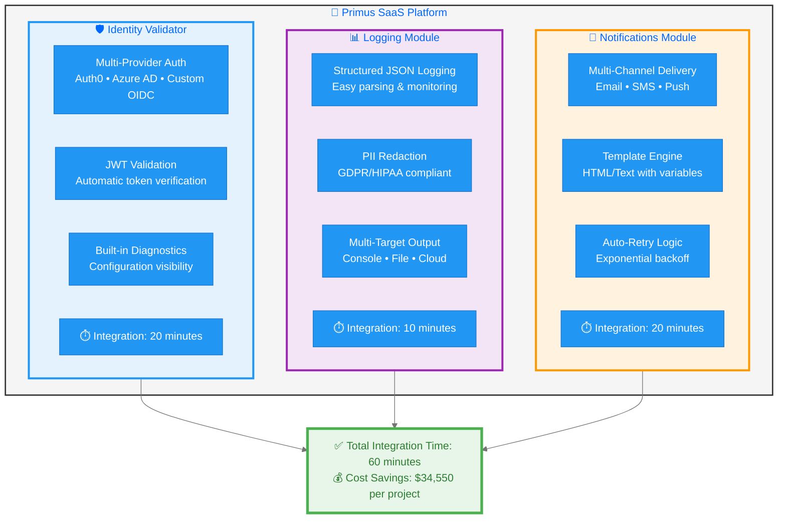

**Usage**: Copy this to https://mermaid.live and export as PNG (1920x1080)

---

## 💰 Diagram 2: ROI Comparison

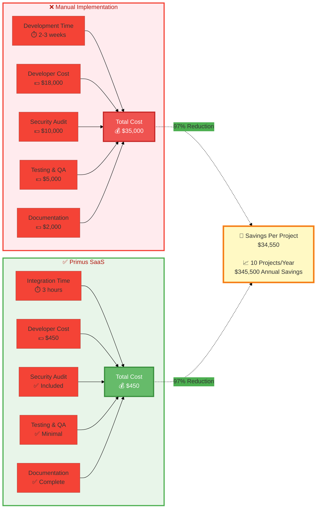

**Usage**: Perfect for showing business value to executives

---

## 🔄 Diagram 3: Complete Integration Flow

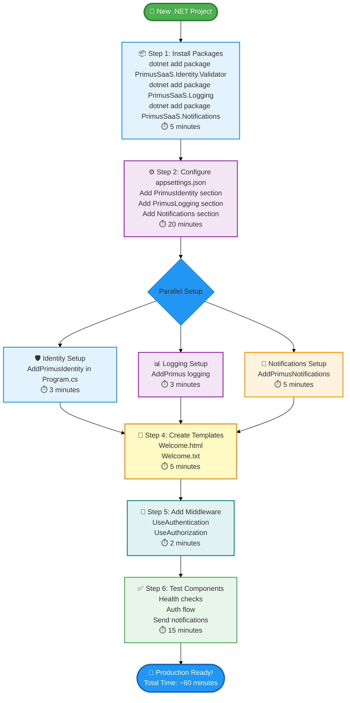

**Usage**: Shows the complete developer journey from start to finish

---

## 🛡️ Diagram 4: Identity Validator Integration Journey

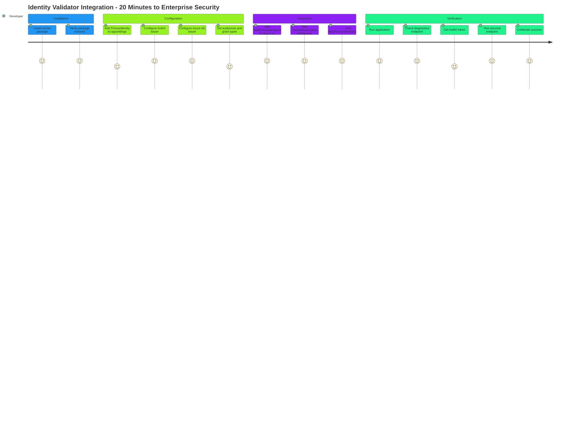

**Usage**: User journey map showing developer experience

---

## 🔴 Diagram 5: Before Primus - Manual Authentication

```mermaid
%%{init: {'theme':'base', 'themeVariables': { 'primaryColor':'#f44336'}}}%%
graph TD
    Start([Need Authentication]) --> Research["📚 Research JWT Libraries<br/>⏱️ 4-8 hours"]
    
    Research --> Install["📦 Install Microsoft.AspNetCore<br/>.Authentication.JwtBearer"]
    
    Install --> Auth0Config["⚙️ Configure Auth0 Manually<br/>TokenValidationParameters<br/>JwtBearerEvents<br/>Custom error handling<br/>⏱️ 8-12 hours"]
    
    Auth0Config --> AzureConfig["⚙️ Configure Azure AD Manually<br/>Different issuer format<br/>Different claim names<br/>More custom logic<br/>⏱️ 8-12 hours"]
    
    AzureConfig --> Policies["🔐 Create Authorization Policies<br/>RequireAuth0<br/>RequireAzureAD<br/>Custom claim requirements<br/>⏱️ 4-6 hours"]
    
    Policies --> Diagnostics["🔍 Build Custom Diagnostics<br/>Extract configuration<br/>Display issuer info<br/>Show loaded schemes<br/>⏱️ 6-8 hours"]
    
    Diagnostics --> Testing["✅ Extensive Testing<br/>Test each provider<br/>Test edge cases<br/>Security review<br/>⏱️ 16-24 hours"]
    
    Testing --> Bugs["🐛 Fix Issues<br/>Issuer mismatches<br/>Audience problems<br/>Claim mapping<br/>⏱️ 8-16 hours"]
    
    Bugs --> Docs["📄 Write Documentation<br/>Configuration guide<br/>Troubleshooting<br/>Examples<br/>⏱️ 8-12 hours"]
    
    Docs --> Done([😓 Done After 2-3 Weeks<br/>500+ lines of code<br/>High maintenance burden])
    
    style Start fill:#f44336,stroke:#c62828,stroke-width:2px,color:#fff
    style Done fill:#f44336,stroke:#c62828,stroke-width:3px,color:#fff
    style Research fill:#FFEBEE,stroke:#f44336,stroke-width:2px
    style Auth0Config fill:#FFCDD2,stroke:#f44336,stroke-width:2px
    style AzureConfig fill:#FFCDD2,stroke:#f44336,stroke-width:2px
    style Policies fill:#FFCDD2,stroke:#f44336,stroke-width:2px
    style Diagnostics fill:#FFCDD2,stroke:#f44336,stroke-width:2px
    style Testing fill:#FFCDD2,stroke:#f44336,stroke-width:2px
    style Bugs fill:#EF5350,stroke:#c62828,stroke-width:2px,color:#fff
    style Docs fill:#FFCDD2,stroke:#f44336,stroke-width:2px
```

**Usage**: Shows the pain of manual implementation

---

## ✅ Diagram 6: After Primus - Simple Integration

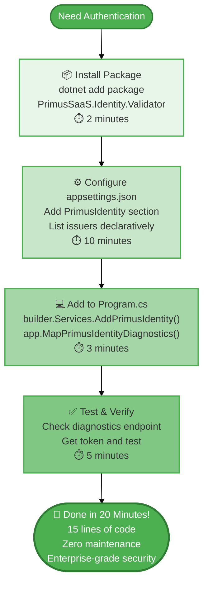

**Usage**: Shows the simplicity of Primus approach

---

## 📊 Diagram 7: Logging Before vs After

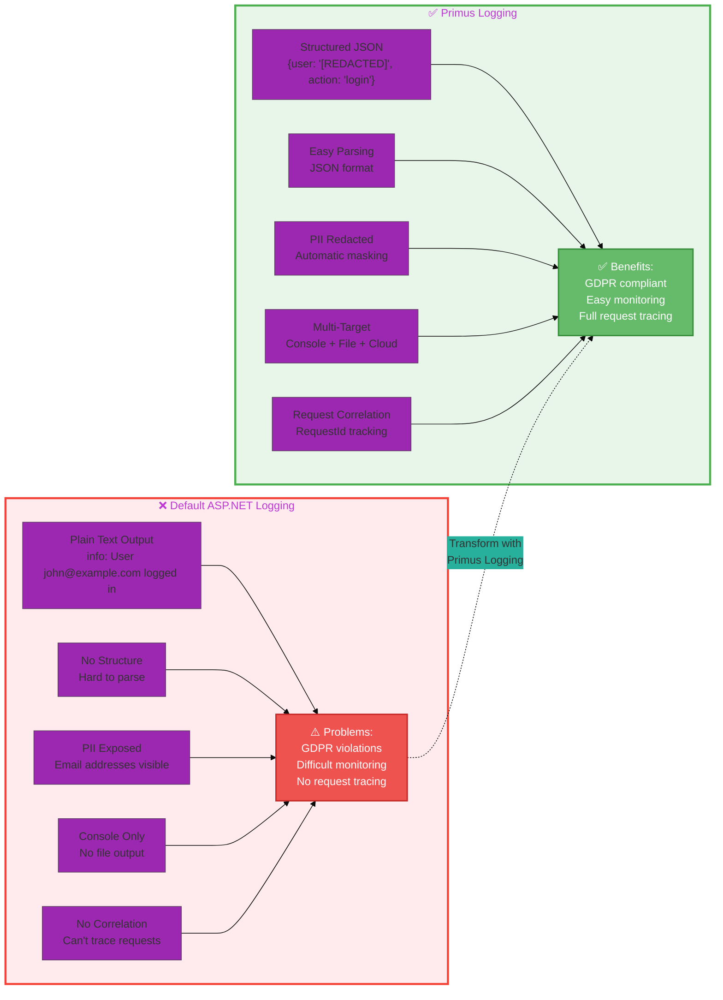

**Usage**: Side-by-side comparison of logging approaches

---

## 🔔 Diagram 8: Notifications Architecture

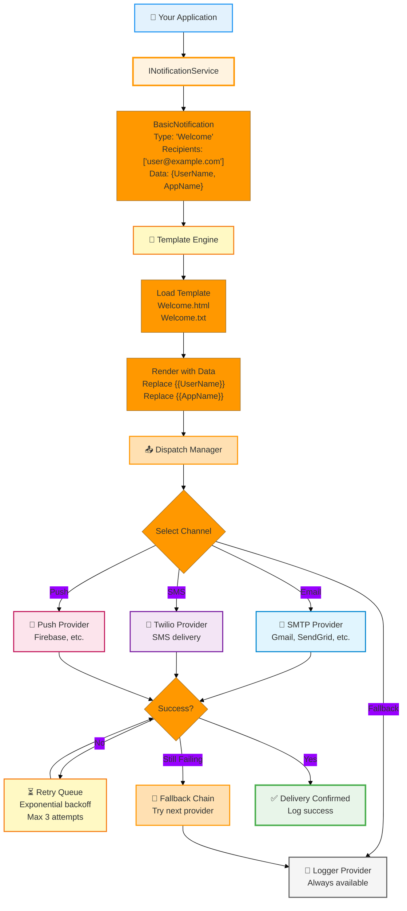

**Usage**: Shows the sophisticated notification architecture

---

## 📈 Diagram 9: Time Savings Comparison

```mermaid
%%{init: {'theme':'base', 'themeVariables': { 'primaryColor':'#2196F3'}}}%%
gantt
    title Development Time Comparison: Manual vs Primus SaaS
    dateFormat X
    axisFormat %s
    
    section Manual Implementation
    Research & Planning           :done, m1, 0, 8h
    Identity Setup (Auth0)        :done, m2, after m1, 12h
    Identity Setup (Azure AD)     :done, m3, after m2, 12h
    Authorization Policies        :done, m4, after m3, 6h
    Custom Diagnostics            :done, m5, after m4, 8h
    Logging Implementation        :done, m6, after m5, 8h
    Notifications (SMTP)          :done, m7, after m6, 8h
    Notifications (SMS)           :done, m8, after m7, 8h
    Testing & Debugging           :done, m9, after m8, 24h
    Documentation                 :done, m10, after m9, 12h
    
    section Primus SaaS
    Install Packages              :active, p1, 0, 5m
    Configure appsettings         :active, p2, after p1, 20m
    Update Program.cs             :active, p3, after p2, 10m
    Create Templates              :active, p4, after p3, 5m
    Add Middleware                :active, p5, after p4, 2m
    Test Components               :active, p6, after p5, 15m
```

**Usage**: Gantt chart showing dramatic time difference

---

## 🎯 Diagram 10: Developer Experience Journey

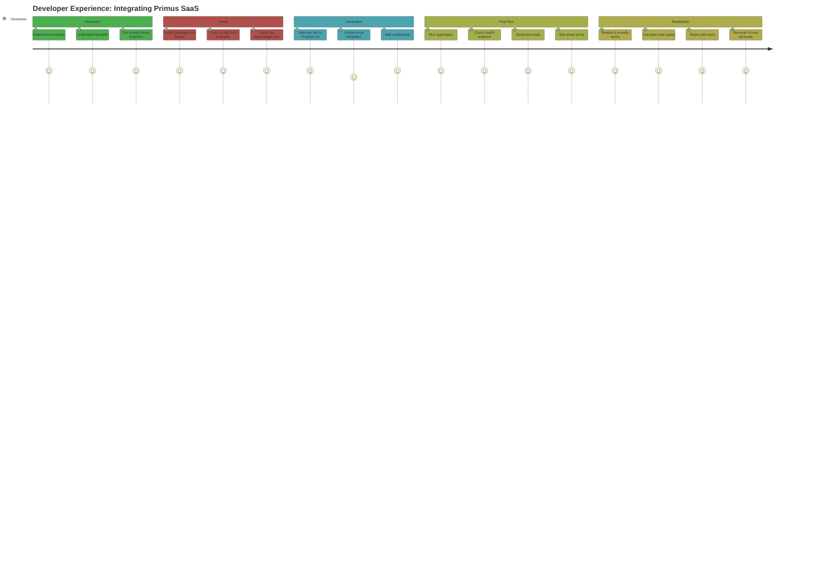

**Usage**: Shows positive developer experience

---

## 🔐 Diagram 11: Security & Compliance Benefits

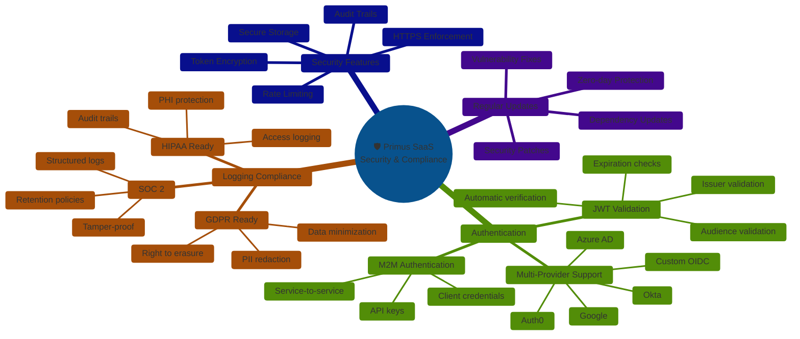

**Usage**: Mind map showing comprehensive security coverage

---

## 💡 How to Use These Diagrams

### Method 1: Render in Markdown Viewers
- **VS Code**: Install "Markdown Preview Mermaid Support" extension
- **GitHub**: Push to repository, diagrams render automatically
- **GitLab**: Built-in Mermaid support
- **Notion**: Copy and paste Mermaid code

### Method 2: Export as Images
1. Go to **https://mermaid.live**
2. Paste any diagram code
3. Click "Actions" → "PNG" or "SVG"
4. Download high-resolution image
5. Use in PowerPoint/Keynote

### Method 3: Use in Documentation
- Keep diagrams in markdown files
- Share documentation directly
- Diagrams render in most modern viewers

---

## 📊 Recommended Diagram Usage in Presentation

| Slide # | Diagram | Purpose |
|---------|---------|---------|
| 1 | Title | Introduction |
| 2 | Diagram 5 (Before Manual) | Show the problem |
| 3 | Diagram 1 (Modules Overview) | Introduce solution |
| 4 | Diagram 2 (ROI Comparison) | Business value |
| 5 | Diagram 3 (Integration Flow) | How it works |
| 6 | Diagram 6 (After Primus) | Show simplicity |
| 7 | Diagram 7 (Logging Comparison) | Feature deep-dive |
| 8 | Diagram 8 (Notifications Architecture) | Technical depth |
| 9 | **LIVE DEMO** | Actual demonstration |
| 10 | Diagram 11 (Security) | Compliance benefits |
| 11 | Diagram 9 (Time Savings) | Quantified results |
| 12 | Diagram 10 (Developer Experience) | Team benefits |
| 13 | Q&A | Questions |
| 14 | Next Steps | Call to action |

---

## 🎨 Customization Tips

### Change Colors
Modify the `%%{init:...}%%` section at the top of each diagram:
```javascript
%%{init: {'theme':'base', 'themeVariables': { 
  'primaryColor':'#YOUR_COLOR',
  'secondaryColor':'#YOUR_COLOR'
}}}%%
```

### Add Your Branding
- Replace "Primus SaaS" with your company name
- Update color scheme to match brand
- Add logo in presentation slides

### Adjust Complexity
- Remove technical details for executive audience
- Add more details for developer audience
- Simplify for quick overview

---

## ✅ Diagram Checklist

- [x] **Diagram 1**: Primus Modules Overview
- [x] **Diagram 2**: ROI Comparison
- [x] **Diagram 3**: Complete Integration Flow
- [x] **Diagram 4**: Identity Integration Journey
- [x] **Diagram 5**: Before Primus (Manual)
- [x] **Diagram 6**: After Primus (Simple)
- [x] **Diagram 7**: Logging Before vs After
- [x] **Diagram 8**: Notifications Architecture
- [x] **Diagram 9**: Time Savings Gantt Chart
- [x] **Diagram 10**: Developer Experience Journey
- [x] **Diagram 11**: Security & Compliance Mind Map

**Total**: 11 professional diagrams ready for presentation!

---

## 🚀 Quick Export Guide

### For PowerPoint Presentation:
1. Visit https://mermaid.live
2. Copy diagram code from this file
3. Paste into Mermaid Live Editor
4. Click "Actions" → "PNG"
5. Set width to 1920px
6. Download and insert into PowerPoint

### For PDF Documentation:
1. Open this file in VS Code with Mermaid extension
2. Right-click diagram → "Export to PDF"
3. Or use "Markdown PDF" extension

### For Web Presentation:
1. Use reveal.js or similar
2. Diagrams render automatically
3. Interactive and zoomable

---

*All diagrams are ready to use. Export them to images or use directly in markdown-compatible presentation tools!*
